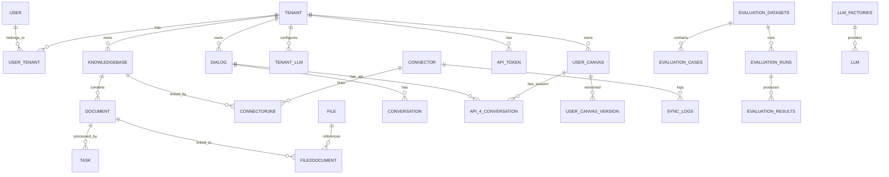

# RAGFlow 数据库表结构设计文档

> 文档版本：1.0  
> 最后更新：2026-02-25  
> 基于代码分析：`api/db/db_models.py`

## 1. 数据库概述

### 1.1 支持的数据库类型

RAGFlow 支持多种关系型数据库作为主数据库存储：

| 数据库类型 | 说明 | 配置方式 |
|-----------|------|----------|
| **MySQL** | 默认数据库，生产环境推荐 | `DB_TYPE=mysql` |
| **PostgreSQL** | 支持高级特性如 Advisory Lock | `DB_TYPE=postgres` |
| **OceanBase** | 兼容MySQL协议的分布式数据库 | `DB_TYPE=oceanbase` |

### 1.2 文档存储引擎（向量数据库）

RAGFlow 使用独立的文档存储引擎来存储向量和文本索引：

| 存储引擎 | 说明 | 配置方式 |
|---------|------|----------|
| **Elasticsearch** | 默认引擎，全文搜索+向量搜索 | `DOC_ENGINE=elasticsearch` |
| **Infinity** | 高性能向量数据库 | `DOC_ENGINE=infinity` |
| **OpenSearch** | AWS托管的Elasticsearch替代方案 | `DOC_ENGINE=opensearch` |
| **OceanBase** | 向量版本，同时支持关系型+向量存储 | `DOC_ENGINE=oceanbase` |

### 1.3 对象存储

用于存储上传的文档文件：

| 存储类型 | 说明 |
|---------|------|
| **MinIO** | 默认对象存储，兼容S3协议 |
| **AWS S3** | Amazon S3 云存储 |
| **Azure Blob** | Azure云存储（SAS/SPN认证） |
| **阿里云 OSS** | 阿里云对象存储 |
| **Google Cloud Storage** | GCS 云存储 |
| **OpenDAL** | 统一存储抽象层 |

### 1.4 缓存与消息队列

| 组件 | 用途 |
|------|------|
| **Redis** | Session缓存、任务队列、分布式锁 |

---

## 2. 核心数据表结构

### 2.1 用户与租户管理

#### 2.1.1 user（用户表）

存储系统用户信息。

| 字段名 | 类型 | 约束 | 说明 |
|--------|------|------|------|
| `id` | VARCHAR(32) | PRIMARY KEY | 用户唯一标识 |
| `access_token` | VARCHAR(255) | INDEX | 访问令牌 |
| `nickname` | VARCHAR(100) | NOT NULL, INDEX | 用户昵称 |
| `password` | VARCHAR(255) | | 密码（加密存储） |
| `email` | VARCHAR(255) | NOT NULL, INDEX | 电子邮箱 |
| `avatar` | TEXT | | 头像（Base64编码） |
| `language` | VARCHAR(32) | INDEX | 界面语言：English/Chinese |
| `color_schema` | VARCHAR(32) | | 主题：Bright/Dark |
| `timezone` | VARCHAR(64) | | 时区设置 |
| `last_login_time` | DATETIME | INDEX | 最后登录时间 |
| `is_authenticated` | CHAR(1) | DEFAULT '1' | 是否已认证 |
| `is_active` | CHAR(1) | DEFAULT '1' | 是否激活 |
| `is_anonymous` | CHAR(1) | DEFAULT '0' | 是否匿名 |
| `login_channel` | VARCHAR(255) | INDEX | 登录渠道 |
| `status` | CHAR(1) | DEFAULT '1' | 状态：0-无效，1-有效 |
| `is_superuser` | BOOLEAN | DEFAULT FALSE | 是否超级管理员 |
| `create_time` | BIGINT | INDEX | 创建时间戳 |
| `update_time` | BIGINT | INDEX | 更新时间戳 |

#### 2.1.2 tenant（租户表）

多租户支持，每个租户有独立的资源空间。

| 字段名 | 类型 | 约束 | 说明 |
|--------|------|------|------|
| `id` | VARCHAR(32) | PRIMARY KEY | 租户唯一标识 |
| `name` | VARCHAR(100) | INDEX | 租户名称 |
| `public_key` | VARCHAR(255) | INDEX | 公钥 |
| `llm_id` | VARCHAR(128) | NOT NULL | 默认LLM模型ID |
| `embd_id` | VARCHAR(128) | NOT NULL | 默认Embedding模型ID |
| `asr_id` | VARCHAR(128) | NOT NULL | 默认ASR模型ID |
| `img2txt_id` | VARCHAR(128) | NOT NULL | 默认图片转文字模型ID |
| `rerank_id` | VARCHAR(128) | NOT NULL | 默认Rerank模型ID |
| `tts_id` | VARCHAR(256) | | 默认TTS模型ID |
| `parser_ids` | VARCHAR(256) | NOT NULL | 支持的文档解析器列表 |
| `credit` | INTEGER | DEFAULT 512 | 信用额度 |
| `status` | CHAR(1) | DEFAULT '1' | 状态 |

#### 2.1.3 user_tenant（用户-租户关联表）

管理用户与租户的多对多关系。

| 字段名 | 类型 | 约束 | 说明 |
|--------|------|------|------|
| `id` | VARCHAR(32) | PRIMARY KEY | 关联ID |
| `user_id` | VARCHAR(32) | NOT NULL, INDEX | 用户ID |
| `tenant_id` | VARCHAR(32) | NOT NULL, INDEX | 租户ID |
| `role` | VARCHAR(32) | NOT NULL | 角色：owner/admin/member |
| `invited_by` | VARCHAR(32) | NOT NULL | 邀请人ID |
| `status` | CHAR(1) | DEFAULT '1' | 状态 |

#### 2.1.4 invitation_code（邀请码表）

| 字段名 | 类型 | 约束 | 说明 |
|--------|------|------|------|
| `id` | VARCHAR(32) | PRIMARY KEY | 邀请码ID |
| `code` | VARCHAR(32) | NOT NULL, INDEX | 邀请码 |
| `visit_time` | DATETIME | INDEX | 使用时间 |
| `user_id` | VARCHAR(32) | INDEX | 使用者ID |
| `tenant_id` | VARCHAR(32) | INDEX | 所属租户 |
| `status` | CHAR(1) | DEFAULT '1' | 状态 |

---

### 2.2 知识库管理

#### 2.2.1 knowledgebase（知识库表）

存储知识库/数据集配置。

| 字段名 | 类型 | 约束 | 说明 |
|--------|------|------|------|
| `id` | VARCHAR(32) | PRIMARY KEY | 知识库ID |
| `avatar` | TEXT | | 知识库头像 |
| `tenant_id` | VARCHAR(32) | NOT NULL, INDEX | 所属租户 |
| `name` | VARCHAR(128) | NOT NULL, INDEX | 知识库名称 |
| `language` | VARCHAR(32) | | 语言：English/Chinese |
| `description` | TEXT | | 描述 |
| `embd_id` | VARCHAR(128) | NOT NULL | Embedding模型ID |
| `permission` | VARCHAR(16) | DEFAULT 'me' | 权限：me/team |
| `created_by` | VARCHAR(32) | NOT NULL, INDEX | 创建者ID |
| `doc_num` | INTEGER | DEFAULT 0 | 文档数量 |
| `token_num` | INTEGER | DEFAULT 0 | Token数量 |
| `chunk_num` | INTEGER | DEFAULT 0 | 分块数量 |
| `similarity_threshold` | FLOAT | DEFAULT 0.2 | 相似度阈值 |
| `vector_similarity_weight` | FLOAT | DEFAULT 0.3 | 向量相似度权重 |
| `parser_id` | VARCHAR(32) | NOT NULL | 默认解析器ID |
| `pipeline_id` | VARCHAR(32) | | Pipeline ID |
| `parser_config` | JSON | | 解析器配置 |
| `pagerank` | INTEGER | DEFAULT 0 | PageRank值 |
| `graphrag_task_id` | VARCHAR(32) | INDEX | GraphRAG任务ID |
| `graphrag_task_finish_at` | DATETIME | | GraphRAG完成时间 |
| `raptor_task_id` | VARCHAR(32) | INDEX | RAPTOR任务ID |
| `raptor_task_finish_at` | DATETIME | | RAPTOR完成时间 |
| `mindmap_task_id` | VARCHAR(32) | INDEX | 思维导图任务ID |
| `mindmap_task_finish_at` | DATETIME | | 思维导图完成时间 |
| `status` | CHAR(1) | DEFAULT '1' | 状态 |

**parser_config 默认结构：**
```json
{
  "pages": [[1, 1000000]],
  "table_context_size": 0,
  "image_context_size": 0
}
```

#### 2.2.2 document（文档表）

存储上传到知识库的文档信息。

| 字段名 | 类型 | 约束 | 说明 |
|--------|------|------|------|
| `id` | VARCHAR(32) | PRIMARY KEY | 文档ID |
| `thumbnail` | TEXT | | 缩略图 |
| `kb_id` | VARCHAR(256) | NOT NULL, INDEX | 所属知识库ID |
| `parser_id` | VARCHAR(32) | NOT NULL, INDEX | 解析器ID |
| `pipeline_id` | VARCHAR(32) | INDEX | Pipeline ID |
| `parser_config` | JSON | | 解析配置 |
| `source_type` | VARCHAR(128) | DEFAULT 'local', INDEX | 来源类型 |
| `type` | VARCHAR(32) | NOT NULL, INDEX | 文件类型 |
| `created_by` | VARCHAR(32) | NOT NULL, INDEX | 创建者 |
| `name` | VARCHAR(255) | INDEX | 文件名 |
| `location` | VARCHAR(255) | INDEX | 存储位置 |
| `size` | INTEGER | DEFAULT 0 | 文件大小 |
| `token_num` | INTEGER | DEFAULT 0 | Token数量 |
| `chunk_num` | INTEGER | DEFAULT 0 | 分块数量 |
| `progress` | FLOAT | DEFAULT 0, INDEX | 处理进度 |
| `progress_msg` | TEXT | | 进度消息 |
| `process_begin_at` | DATETIME | INDEX | 开始处理时间 |
| `process_duration` | FLOAT | DEFAULT 0 | 处理耗时 |
| `suffix` | VARCHAR(32) | NOT NULL, INDEX | 文件扩展名 |
| `run` | CHAR(1) | DEFAULT '0', INDEX | 运行状态：0-停止，1-运行，2-取消 |
| `status` | CHAR(1) | DEFAULT '1' | 状态 |

---

### 2.3 文件管理

#### 2.3.1 file（文件表）

文件系统管理，支持文件夹层级。

| 字段名 | 类型 | 约束 | 说明 |
|--------|------|------|------|
| `id` | VARCHAR(32) | PRIMARY KEY | 文件ID |
| `parent_id` | VARCHAR(32) | NOT NULL, INDEX | 父文件夹ID |
| `tenant_id` | VARCHAR(32) | NOT NULL, INDEX | 租户ID |
| `created_by` | VARCHAR(32) | NOT NULL, INDEX | 创建者 |
| `name` | VARCHAR(255) | NOT NULL, INDEX | 文件/文件夹名 |
| `location` | VARCHAR(255) | INDEX | 存储位置 |
| `size` | INTEGER | DEFAULT 0 | 文件大小 |
| `type` | VARCHAR(32) | NOT NULL, INDEX | 类型：folder/doc/... |
| `source_type` | VARCHAR(128) | DEFAULT '', INDEX | 来源类型 |

#### 2.3.2 file2document（文件-文档关联表）

| 字段名 | 类型 | 约束 | 说明 |
|--------|------|------|------|
| `id` | VARCHAR(32) | PRIMARY KEY | 关联ID |
| `file_id` | VARCHAR(32) | INDEX | 文件ID |
| `document_id` | VARCHAR(32) | INDEX | 文档ID |

---

### 2.4 对话与会话管理

#### 2.4.1 dialog（对话助手表）

存储Chat Assistant配置。

| 字段名 | 类型 | 约束 | 说明 |
|--------|------|------|------|
| `id` | VARCHAR(32) | PRIMARY KEY | 对话助手ID |
| `tenant_id` | VARCHAR(32) | NOT NULL, INDEX | 租户ID |
| `name` | VARCHAR(255) | INDEX | 助手名称 |
| `description` | TEXT | | 描述 |
| `icon` | TEXT | | 图标 |
| `language` | VARCHAR(32) | INDEX | 语言 |
| `llm_id` | VARCHAR(128) | NOT NULL | LLM模型ID |
| `llm_setting` | JSON | | LLM设置 |
| `prompt_type` | VARCHAR(16) | DEFAULT 'simple', INDEX | 提示词类型 |
| `prompt_config` | JSON | | 提示词配置 |
| `meta_data_filter` | JSON | | 元数据过滤条件 |
| `similarity_threshold` | FLOAT | DEFAULT 0.2 | 相似度阈值 |
| `vector_similarity_weight` | FLOAT | DEFAULT 0.3 | 向量权重 |
| `top_n` | INTEGER | DEFAULT 6 | 返回Top N结果 |
| `top_k` | INTEGER | DEFAULT 1024 | 检索Top K |
| `do_refer` | CHAR(1) | DEFAULT '1' | 是否显示引用 |
| `rerank_id` | VARCHAR(128) | NOT NULL | Rerank模型ID |
| `kb_ids` | JSON | DEFAULT [] | 关联知识库列表 |
| `status` | CHAR(1) | DEFAULT '1' | 状态 |

**llm_setting 默认结构：**
```json
{
  "temperature": 0.1,
  "top_p": 0.3,
  "frequency_penalty": 0.7,
  "presence_penalty": 0.4,
  "max_tokens": 512
}
```

**prompt_config 默认结构：**
```json
{
  "system": "",
  "prologue": "Hi! I'm your assistant. What can I do for you?",
  "parameters": [],
  "empty_response": "Sorry! No relevant content was found in the knowledge base!"
}
```

#### 2.4.2 conversation（会话表）

存储用户与助手的对话历史。

| 字段名 | 类型 | 约束 | 说明 |
|--------|------|------|------|
| `id` | VARCHAR(32) | PRIMARY KEY | 会话ID |
| `dialog_id` | VARCHAR(32) | NOT NULL, INDEX | 对话助手ID |
| `name` | VARCHAR(255) | INDEX | 会话名称 |
| `message` | JSON | | 消息历史 |
| `reference` | JSON | DEFAULT [] | 引用信息 |
| `user_id` | VARCHAR(255) | INDEX | 用户ID |

#### 2.4.3 api_4_conversation（API会话表）

存储通过API创建的会话，支持Agent和Chat。

| 字段名 | 类型 | 约束 | 说明 |
|--------|------|------|------|
| `id` | VARCHAR(32) | PRIMARY KEY | 会话ID |
| `name` | VARCHAR(255) | | 会话名称 |
| `dialog_id` | VARCHAR(32) | NOT NULL, INDEX | 对话/Agent ID |
| `user_id` | VARCHAR(255) | NOT NULL, INDEX | 用户ID |
| `exp_user_id` | VARCHAR(255) | INDEX | 外部用户ID |
| `message` | JSON | | 消息历史 |
| `reference` | JSON | DEFAULT [] | 引用信息 |
| `tokens` | INTEGER | DEFAULT 0 | Token消耗 |
| `source` | VARCHAR(16) | INDEX | 来源：agent/dialog |
| `dsl` | JSON | DEFAULT {} | Agent DSL状态 |
| `duration` | FLOAT | DEFAULT 0, INDEX | 响应时长 |
| `round` | INTEGER | DEFAULT 0, INDEX | 对话轮数 |
| `thumb_up` | INTEGER | DEFAULT 0, INDEX | 点赞数 |
| `errors` | TEXT | | 错误信息 |

---

### 2.5 LLM模型管理

#### 2.5.1 llm_factories（LLM厂商表）

| 字段名 | 类型 | 约束 | 说明 |
|--------|------|------|------|
| `name` | VARCHAR(128) | PRIMARY KEY | 厂商名称 |
| `logo` | TEXT | | Logo |
| `tags` | VARCHAR(255) | NOT NULL, INDEX | 支持的模型类型 |
| `rank` | INTEGER | DEFAULT 0 | 排序权重 |
| `status` | CHAR(1) | DEFAULT '1' | 状态 |

#### 2.5.2 llm（LLM模型字典表）

| 字段名 | 类型 | 约束 | 说明 |
|--------|------|------|------|
| `llm_name` | VARCHAR(128) | PRIMARY KEY（复合） | 模型名称 |
| `fid` | VARCHAR(128) | PRIMARY KEY（复合）, INDEX | 厂商ID |
| `model_type` | VARCHAR(128) | NOT NULL, INDEX | 模型类型 |
| `max_tokens` | INTEGER | DEFAULT 0 | 最大Token数 |
| `tags` | VARCHAR(255) | NOT NULL, INDEX | 标签 |
| `is_tools` | BOOLEAN | DEFAULT FALSE | 是否支持工具调用 |
| `status` | CHAR(1) | DEFAULT '1' | 状态 |

#### 2.5.3 tenant_llm（租户LLM配置表）

存储租户配置的LLM API密钥。

| 字段名 | 类型 | 约束 | 说明 |
|--------|------|------|------|
| `tenant_id` | VARCHAR(32) | PRIMARY KEY（复合）, INDEX | 租户ID |
| `llm_factory` | VARCHAR(128) | PRIMARY KEY（复合）, INDEX | LLM厂商 |
| `llm_name` | VARCHAR(128) | PRIMARY KEY（复合）, INDEX | 模型名称 |
| `model_type` | VARCHAR(128) | INDEX | 模型类型 |
| `api_key` | TEXT | | API密钥 |
| `api_base` | VARCHAR(255) | | API基础URL |
| `max_tokens` | INTEGER | DEFAULT 8192, INDEX | 最大Token |
| `used_tokens` | INTEGER | DEFAULT 0, INDEX | 已使用Token |
| `status` | CHAR(1) | DEFAULT '1', INDEX | 状态 |

---

### 2.6 API与认证

#### 2.6.1 api_token（API令牌表）

| 字段名 | 类型 | 约束 | 说明 |
|--------|------|------|------|
| `tenant_id` | VARCHAR(32) | PRIMARY KEY（复合）, INDEX | 租户ID |
| `token` | VARCHAR(255) | PRIMARY KEY（复合）, INDEX | API Token |
| `dialog_id` | VARCHAR(32) | INDEX | 关联的Dialog/Agent ID |
| `source` | VARCHAR(16) | INDEX | 来源：agent/dialog |
| `beta` | VARCHAR(255) | INDEX | Beta标识 |

---

### 2.7 任务管理

#### 2.7.1 task（任务表）

存储文档处理任务。

| 字段名 | 类型 | 约束 | 说明 |
|--------|------|------|------|
| `id` | VARCHAR(32) | PRIMARY KEY | 任务ID |
| `doc_id` | VARCHAR(32) | NOT NULL, INDEX | 文档ID |
| `from_page` | INTEGER | DEFAULT 0 | 起始页 |
| `to_page` | INTEGER | DEFAULT 100000000 | 结束页 |
| `task_type` | VARCHAR(32) | DEFAULT '' | 任务类型 |
| `priority` | INTEGER | DEFAULT 0 | 优先级 |
| `begin_at` | DATETIME | INDEX | 开始时间 |
| `process_duration` | FLOAT | DEFAULT 0 | 处理时长 |
| `progress` | FLOAT | DEFAULT 0, INDEX | 进度 |
| `progress_msg` | TEXT | | 进度消息 |
| `retry_count` | INTEGER | DEFAULT 0 | 重试次数 |
| `digest` | TEXT | | 任务摘要 |
| `chunk_ids` | LONGTEXT | | 分块ID列表 |

---

### 2.8 Agent与Canvas

#### 2.8.1 user_canvas（用户画布表）

存储Agent/Workflow定义。

| 字段名 | 类型 | 约束 | 说明 |
|--------|------|------|------|
| `id` | VARCHAR(32) | PRIMARY KEY | 画布ID |
| `avatar` | TEXT | | 头像 |
| `user_id` | VARCHAR(255) | NOT NULL, INDEX | 用户ID |
| `title` | VARCHAR(255) | | 标题 |
| `permission` | VARCHAR(16) | DEFAULT 'me', INDEX | 权限 |
| `description` | TEXT | | 描述 |
| `canvas_type` | VARCHAR(32) | INDEX | 画布类型 |
| `canvas_category` | VARCHAR(32) | DEFAULT 'agent_canvas', INDEX | 类别：agent_canvas/dataflow_canvas |
| `dsl` | JSON | DEFAULT {} | DSL定义 |

#### 2.8.2 canvas_template（画布模板表）

| 字段名 | 类型 | 约束 | 说明 |
|--------|------|------|------|
| `id` | VARCHAR(32) | PRIMARY KEY | 模板ID |
| `avatar` | TEXT | | 头像 |
| `title` | JSON | | 多语言标题 |
| `description` | JSON | | 多语言描述 |
| `canvas_type` | VARCHAR(32) | INDEX | 画布类型 |
| `canvas_category` | VARCHAR(32) | DEFAULT 'agent_canvas', INDEX | 类别 |
| `dsl` | JSON | DEFAULT {} | DSL模板 |

#### 2.8.3 user_canvas_version（画布版本表）

| 字段名 | 类型 | 约束 | 说明 |
|--------|------|------|------|
| `id` | VARCHAR(32) | PRIMARY KEY | 版本ID |
| `user_canvas_id` | VARCHAR(255) | NOT NULL, INDEX | 画布ID |
| `title` | VARCHAR(255) | | 版本标题 |
| `description` | TEXT | | 版本描述 |
| `dsl` | JSON | DEFAULT {} | DSL快照 |

---

### 2.9 数据连接器

#### 2.9.1 connector（连接器表）

| 字段名 | 类型 | 约束 | 说明 |
|--------|------|------|------|
| `id` | VARCHAR(32) | PRIMARY KEY | 连接器ID |
| `tenant_id` | VARCHAR(32) | NOT NULL, INDEX | 租户ID |
| `name` | VARCHAR(128) | NOT NULL | 连接器名称 |
| `source` | VARCHAR(128) | NOT NULL, INDEX | 数据源类型 |
| `input_type` | VARCHAR(128) | NOT NULL, INDEX | 输入类型：poll/event |
| `config` | JSON | DEFAULT {} | 配置信息 |
| `refresh_freq` | INTEGER | DEFAULT 0 | 刷新频率 |
| `prune_freq` | INTEGER | DEFAULT 0 | 清理频率 |
| `timeout_secs` | INTEGER | DEFAULT 3600 | 超时时间 |
| `indexing_start` | DATETIME | INDEX | 索引开始时间 |
| `status` | VARCHAR(16) | DEFAULT 'schedule', INDEX | 状态 |

#### 2.9.2 connector2kb（连接器-知识库关联表）

| 字段名 | 类型 | 约束 | 说明 |
|--------|------|------|------|
| `id` | VARCHAR(32) | PRIMARY KEY | 关联ID |
| `connector_id` | VARCHAR(32) | NOT NULL, INDEX | 连接器ID |
| `kb_id` | VARCHAR(32) | NOT NULL, INDEX | 知识库ID |
| `auto_parse` | CHAR(1) | DEFAULT '1' | 是否自动解析 |

#### 2.9.3 sync_logs（同步日志表）

| 字段名 | 类型 | 约束 | 说明 |
|--------|------|------|------|
| `id` | VARCHAR(32) | PRIMARY KEY | 日志ID |
| `connector_id` | VARCHAR(32) | INDEX | 连接器ID |
| `status` | VARCHAR(128) | NOT NULL, INDEX | 同步状态 |
| `from_beginning` | CHAR(1) | DEFAULT '0' | 是否从头开始 |
| `new_docs_indexed` | INTEGER | DEFAULT 0 | 新增文档数 |
| `total_docs_indexed` | INTEGER | DEFAULT 0 | 总文档数 |
| `docs_removed_from_index` | INTEGER | DEFAULT 0 | 删除文档数 |
| `error_msg` | TEXT | DEFAULT '' | 错误信息 |
| `error_count` | INTEGER | DEFAULT 0 | 错误计数 |
| `full_exception_trace` | TEXT | | 完整异常栈 |
| `time_started` | DATETIME | INDEX | 开始时间 |
| `poll_range_start` | VARCHAR(255) | INDEX | 轮询起始时间 |
| `poll_range_end` | VARCHAR(255) | INDEX | 轮询结束时间 |
| `kb_id` | VARCHAR(32) | NOT NULL, INDEX | 知识库ID |

---

### 2.10 MCP服务器

#### 2.10.1 mcp_server（MCP服务器表）

| 字段名 | 类型 | 约束 | 说明 |
|--------|------|------|------|
| `id` | VARCHAR(32) | PRIMARY KEY | 服务器ID |
| `name` | VARCHAR(255) | NOT NULL | 服务器名称 |
| `tenant_id` | VARCHAR(32) | NOT NULL, INDEX | 租户ID |
| `url` | VARCHAR(2048) | NOT NULL | 服务器URL |
| `server_type` | VARCHAR(32) | NOT NULL | 服务器类型 |
| `description` | TEXT | | 描述 |
| `variables` | JSON | DEFAULT {} | 变量配置 |
| `headers` | JSON | DEFAULT {} | 请求头配置 |

---

### 2.11 搜索应用

#### 2.11.1 search（搜索应用表）

| 字段名 | 类型 | 约束 | 说明 |
|--------|------|------|------|
| `id` | VARCHAR(32) | PRIMARY KEY | 搜索应用ID |
| `avatar` | TEXT | | 头像 |
| `tenant_id` | VARCHAR(32) | NOT NULL, INDEX | 租户ID |
| `name` | VARCHAR(128) | NOT NULL, INDEX | 应用名称 |
| `description` | TEXT | | 描述 |
| `created_by` | VARCHAR(32) | NOT NULL, INDEX | 创建者 |
| `search_config` | JSON | | 搜索配置 |
| `status` | CHAR(1) | DEFAULT '1' | 状态 |

**search_config 结构：**
```json
{
  "kb_ids": [],
  "doc_ids": [],
  "similarity_threshold": 0.2,
  "vector_similarity_weight": 0.3,
  "use_kg": false,
  "rerank_id": "",
  "top_k": 1024,
  "summary": false,
  "chat_id": "",
  "llm_setting": {},
  "highlight": false,
  "keyword": false,
  "web_search": false,
  "related_search": false,
  "query_mindmap": false
}
```

---

### 2.12 评估系统

#### 2.12.1 evaluation_datasets（评估数据集表）

| 字段名 | 类型 | 约束 | 说明 |
|--------|------|------|------|
| `id` | VARCHAR(32) | PRIMARY KEY | 数据集ID |
| `tenant_id` | VARCHAR(32) | NOT NULL, INDEX | 租户ID |
| `name` | VARCHAR(255) | NOT NULL, INDEX | 数据集名称 |
| `description` | TEXT | | 描述 |
| `kb_ids` | JSON | NOT NULL | 关联知识库 |
| `created_by` | VARCHAR(32) | NOT NULL, INDEX | 创建者 |
| `create_time` | BIGINT | NOT NULL, INDEX | 创建时间 |
| `update_time` | BIGINT | NOT NULL | 更新时间 |
| `status` | INTEGER | DEFAULT 1 | 状态 |

#### 2.12.2 evaluation_cases（评估用例表）

| 字段名 | 类型 | 约束 | 说明 |
|--------|------|------|------|
| `id` | VARCHAR(32) | PRIMARY KEY | 用例ID |
| `dataset_id` | VARCHAR(32) | NOT NULL, INDEX | 数据集ID |
| `question` | TEXT | NOT NULL | 测试问题 |
| `reference_answer` | TEXT | | 参考答案 |
| `relevant_doc_ids` | JSON | | 相关文档ID |
| `relevant_chunk_ids` | JSON | | 相关分块ID |
| `metadata` | JSON | | 元数据 |
| `create_time` | BIGINT | NOT NULL | 创建时间 |

#### 2.12.3 evaluation_runs（评估运行表）

| 字段名 | 类型 | 约束 | 说明 |
|--------|------|------|------|
| `id` | VARCHAR(32) | PRIMARY KEY | 运行ID |
| `dataset_id` | VARCHAR(32) | NOT NULL, INDEX | 数据集ID |
| `dialog_id` | VARCHAR(32) | NOT NULL, INDEX | 对话助手ID |
| `name` | VARCHAR(255) | NOT NULL | 运行名称 |
| `config_snapshot` | JSON | NOT NULL | 配置快照 |
| `metrics_summary` | JSON | | 指标汇总 |
| `status` | VARCHAR(32) | DEFAULT 'PENDING' | 状态 |
| `created_by` | VARCHAR(32) | NOT NULL, INDEX | 创建者 |
| `create_time` | BIGINT | NOT NULL, INDEX | 创建时间 |
| `complete_time` | BIGINT | | 完成时间 |

#### 2.12.4 evaluation_results（评估结果表）

| 字段名 | 类型 | 约束 | 说明 |
|--------|------|------|------|
| `id` | VARCHAR(32) | PRIMARY KEY | 结果ID |
| `run_id` | VARCHAR(32) | NOT NULL, INDEX | 运行ID |
| `case_id` | VARCHAR(32) | NOT NULL, INDEX | 用例ID |
| `generated_answer` | TEXT | NOT NULL | 生成的答案 |
| `retrieved_chunks` | JSON | NOT NULL | 检索的分块 |
| `metrics` | JSON | NOT NULL | 评估指标 |
| `execution_time` | FLOAT | NOT NULL | 执行时间 |
| `token_usage` | JSON | | Token使用情况 |
| `create_time` | BIGINT | NOT NULL | 创建时间 |

---

### 2.13 记忆系统

#### 2.13.1 memory（记忆表）

| 字段名 | 类型 | 约束 | 说明 |
|--------|------|------|------|
| `id` | VARCHAR(32) | PRIMARY KEY | 记忆ID |
| `name` | VARCHAR(128) | NOT NULL | 记忆名称 |
| `avatar` | TEXT | | 头像 |
| `tenant_id` | VARCHAR(32) | NOT NULL, INDEX | 租户ID |
| `memory_type` | INTEGER | DEFAULT 1, INDEX | 记忆类型（位标志） |
| `storage_type` | VARCHAR(32) | DEFAULT 'table', INDEX | 存储类型：table/graph |
| `embd_id` | VARCHAR(128) | NOT NULL | Embedding模型ID |
| `llm_id` | VARCHAR(128) | NOT NULL | Chat模型ID |
| `permissions` | VARCHAR(16) | DEFAULT 'me', INDEX | 权限 |
| `description` | TEXT | | 描述 |
| `memory_size` | INTEGER | DEFAULT 5242880 | 内存大小 |
| `forgetting_policy` | VARCHAR(32) | DEFAULT 'FIFO' | 遗忘策略：LRU/FIFO |
| `temperature` | FLOAT | DEFAULT 0.5 | 温度参数 |
| `system_prompt` | TEXT | | 系统提示词 |
| `user_prompt` | TEXT | | 用户提示词 |

**memory_type 位标志说明：**
- 1 = raw（原始记忆）
- 2 = semantic（语义记忆）
- 4 = episodic（情景记忆）
- 8 = procedural（程序记忆）
- 例如：5 = raw + episodic

---

### 2.14 系统设置

#### 2.14.1 system_settings（系统设置表）

| 字段名 | 类型 | 约束 | 说明 |
|--------|------|------|------|
| `name` | VARCHAR(128) | PRIMARY KEY | 设置名称 |
| `source` | VARCHAR(32) | NOT NULL | 来源 |
| `data_type` | VARCHAR(32) | NOT NULL | 数据类型 |
| `value` | TEXT | NOT NULL | 设置值 |

---

### 2.15 监控与日志

#### 2.15.1 tenant_langfuse（Langfuse监控配置表）

| 字段名 | 类型 | 约束 | 说明 |
|--------|------|------|------|
| `tenant_id` | VARCHAR(32) | PRIMARY KEY | 租户ID |
| `secret_key` | VARCHAR(2048) | NOT NULL, INDEX | Secret Key |
| `public_key` | VARCHAR(2048) | NOT NULL, INDEX | Public Key |
| `host` | VARCHAR(128) | NOT NULL, INDEX | Langfuse Host |

#### 2.15.2 pipeline_operation_log（Pipeline操作日志表）

| 字段名 | 类型 | 约束 | 说明 |
|--------|------|------|------|
| `id` | VARCHAR(32) | PRIMARY KEY | 日志ID |
| `document_id` | VARCHAR(32) | INDEX | 文档ID |
| `tenant_id` | VARCHAR(32) | NOT NULL, INDEX | 租户ID |
| `kb_id` | VARCHAR(32) | NOT NULL, INDEX | 知识库ID |
| `pipeline_id` | VARCHAR(32) | INDEX | Pipeline ID |
| `pipeline_title` | VARCHAR(32) | INDEX | Pipeline标题 |
| `parser_id` | VARCHAR(32) | NOT NULL, INDEX | 解析器ID |
| `document_name` | VARCHAR(255) | NOT NULL | 文档名称 |
| `document_suffix` | VARCHAR(255) | NOT NULL | 文件后缀 |
| `document_type` | VARCHAR(255) | NOT NULL | 文档类型 |
| `source_from` | VARCHAR(255) | NOT NULL | 来源 |
| `progress` | FLOAT | DEFAULT 0, INDEX | 进度 |
| `progress_msg` | TEXT | | 进度消息 |
| `process_begin_at` | DATETIME | INDEX | 开始时间 |
| `process_duration` | FLOAT | DEFAULT 0 | 处理时长 |
| `dsl` | JSON | DEFAULT {} | DSL配置 |
| `task_type` | VARCHAR(32) | DEFAULT '' | 任务类型 |
| `operation_status` | VARCHAR(32) | NOT NULL | 操作状态 |
| `avatar` | TEXT | | 头像 |
| `status` | CHAR(1) | DEFAULT '1' | 状态 |

---

## 3. ER关系图



---

## 4. 索引设计说明

### 4.1 通用索引策略

所有表都包含以下通用时间索引：
- `create_time` - 创建时间索引，用于时间范围查询
- `update_time` - 更新时间索引

### 4.2 关键查询优化索引

| 表名 | 索引字段 | 用途 |
|------|----------|------|
| `user` | `email`, `access_token` | 登录认证 |
| `knowledgebase` | `tenant_id`, `name` | 知识库列表查询 |
| `document` | `kb_id`, `name`, `run` | 文档列表与状态查询 |
| `dialog` | `tenant_id`, `status` | 对话助手列表 |
| `conversation` | `dialog_id`, `user_id` | 会话历史查询 |
| `task` | `doc_id`, `progress` | 任务状态追踪 |

---

## 5. 数据库连接池配置

RAGFlow 使用连接池管理数据库连接，支持自动重试机制：

```python
# 连接池配置
pool_config = {
    'max_retries': 5,      # 最大重试次数
    'retry_delay': 1,      # 初始重试延迟（秒）
}
```

### 5.1 支持的连接池类型

| 数据库 | 连接池实现 |
|--------|-----------|
| MySQL | `RetryingPooledMySQLDatabase` |
| PostgreSQL | `RetryingPooledPostgresqlDatabase` |
| OceanBase | `RetryingPooledOceanBaseDatabase` |

### 5.2 分布式锁实现

| 数据库 | 锁实现 |
|--------|--------|
| MySQL/OceanBase | `GET_LOCK()` / `RELEASE_LOCK()` |
| PostgreSQL | `pg_try_advisory_lock()` / `pg_advisory_unlock()` |

---

## 6. 数据迁移

RAGFlow 支持自动数据库迁移，在启动时检查并添加新字段：

```python
# 迁移示例
migrate_db()  # 自动检测并应用数据库结构变更
```

主要迁移操作：
- `alter_db_add_column` - 添加新列
- `alter_db_column_type` - 修改列类型
- `alter_db_rename_column` - 重命名列

