# RAGFlow 系统架构设计文档

> 文档版本：1.0  
> 最后更新：2026-02-25  
> 基于代码分析

## 1. 系统概述

RAGFlow 是一个基于深度文档理解的开源 RAG（检索增强生成）引擎，采用微服务架构设计，具备以下核心特性：

- **深度文档理解**：支持多种文档格式的智能解析
- **可视化工作流**：Agent/Workflow 可视化编排
- **多模型支持**：集成 50+ LLM 厂商
- **企业级特性**：多租户、权限管理、API 接口

---

## 2. 整体架构

### 2.1 系统架构图

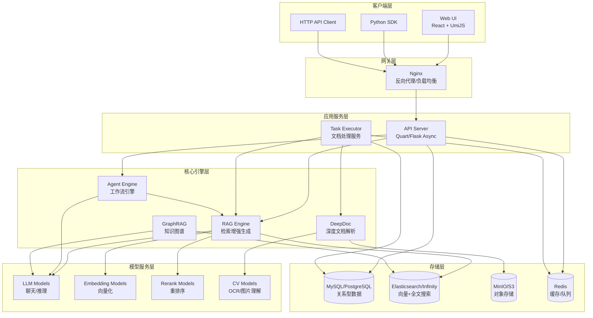

### 2.2 部署架构

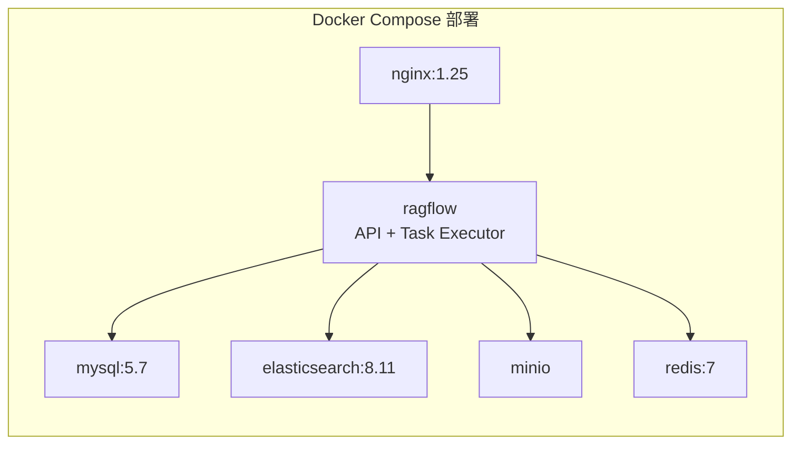

---

## 3. 核心模块设计

### 3.1 目录结构

```
ragflow/
├── api/                    # API服务层
│   ├── apps/               # API路由模块
│   │   ├── sdk/            # SDK HTTP API (v1)
│   │   ├── auth/           # 认证模块
│   │   ├── kb_app.py       # 知识库管理
│   │   ├── document_app.py # 文档管理
│   │   ├── dialog_app.py   # 对话助手
│   │   ├── conversation_app.py # 会话管理
│   │   ├── chunk_app.py    # 分块管理
│   │   ├── canvas_app.py   # Agent画布
│   │   └── ...
│   ├── db/                 # 数据访问层
│   │   ├── db_models.py    # ORM模型定义
│   │   ├── services/       # 业务服务层
│   │   └── joint_services/ # 联合查询服务
│   └── utils/              # 工具函数
│
├── rag/                    # RAG核心引擎
│   ├── app/                # 文档解析器
│   ├── llm/                # LLM模型抽象
│   ├── nlp/                # NLP工具
│   ├── graphrag/           # 知识图谱RAG
│   ├── flow/               # 数据流处理
│   ├── prompts/            # 提示词模板
│   └── utils/              # 工具类
│
├── deepdoc/                # 深度文档解析
│   ├── parser/             # 格式解析器
│   │   ├── pdf_parser.py
│   │   ├── docx_parser.py
│   │   ├── excel_parser.py
│   │   └── ...
│   └── vision/             # 视觉模型
│       ├── ocr.py          # OCR识别
│       ├── layout_recognizer.py # 版面分析
│       └── ...
│
├── agent/                  # Agent引擎
│   ├── canvas.py           # 画布/工作流引擎
│   ├── component/          # 组件库
│   ├── plugin/             # 插件系统
│   ├── sandbox/            # 代码沙箱
│   └── templates/          # Agent模板
│
├── common/                 # 公共模块
│   ├── settings.py         # 全局配置
│   ├── doc_store/          # 文档存储抽象
│   └── data_source/        # 数据源连接器
│
├── memory/                 # 记忆系统
│   ├── services/           # 记忆服务
│   └── utils/              # 存储适配器
│
├── mcp/                    # MCP协议支持
│   ├── client/             # MCP客户端
│   └── server/             # MCP服务端
│
├── web/                    # 前端应用
│   └── src/
│       ├── pages/          # 页面组件
│       ├── components/     # 通用组件
│       └── hooks/          # React Hooks
│
├── conf/                   # 配置文件
│   ├── llm_factories.json  # LLM厂商配置
│   └── service_conf.yaml   # 服务配置
│
└── docker/                 # Docker部署
    ├── docker-compose.yml
    └── nginx/
```

---

## 4. 核心组件详解

### 4.1 API服务层 (`api/`)

#### 4.1.1 Web框架

- **框架**: Quart（异步Flask）
- **CORS**: quart-cors
- **OpenAPI**: quart-schema
- **认证**: 自定义JWT + API Token

#### 4.1.2 路由模块

| 模块 | 路径前缀 | 说明 |
|------|----------|------|
| `kb_app` | `/v1/kb` | 知识库管理 |
| `document_app` | `/v1/document` | 文档管理 |
| `dialog_app` | `/v1/dialog` | 对话助手 |
| `conversation_app` | `/v1/conversation` | 会话管理 |
| `chunk_app` | `/v1/chunk` | 分块管理 |
| `canvas_app` | `/v1/canvas` | Agent画布 |
| `llm_app` | `/v1/llm` | LLM配置 |
| `user_app` | `/v1/user` | 用户管理 |
| `file_app` | `/v1/file` | 文件管理 |

#### 4.1.3 SDK API (`api/apps/sdk/`)

| 模块 | 路径前缀 | 说明 |
|------|----------|------|
| `dataset` | `/api/v1/datasets` | 数据集CRUD |
| `doc` | `/api/v1/datasets/{id}/documents` | 文档操作 |
| `chat` | `/api/v1/chats` | Chat助手 |
| `session` | `/api/v1/chats/{id}/sessions` | 会话管理 |
| `agents` | `/api/v1/agents` | Agent管理 |
| `files` | `/api/v1/file` | 文件操作 |
| `memories` | `/api/v1/memories` | 记忆系统 |

### 4.2 RAG引擎 (`rag/`)

#### 4.2.1 文档解析器 (`rag/app/`)

支持多种分块策略：

| 解析器 | 类型 | 说明 |
|--------|------|------|
| `naive` | General | 通用文档解析 |
| `book` | Book | 书籍章节解析 |
| `paper` | Paper | 学术论文解析 |
| `laws` | Laws | 法律文档解析 |
| `manual` | Manual | 技术手册解析 |
| `qa` | Q&A | 问答对解析 |
| `table` | Table | 表格解析 |
| `presentation` | Presentation | PPT解析 |
| `picture` | Picture | 图片解析 |
| `audio` | Audio | 音频转录 |
| `email` | Email | 邮件解析 |
| `tag` | Tag | 标签解析 |
| `one` | One | 整文档单块 |
| `resume` | Resume | 简历解析 |

#### 4.2.2 LLM模型抽象 (`rag/llm/`)

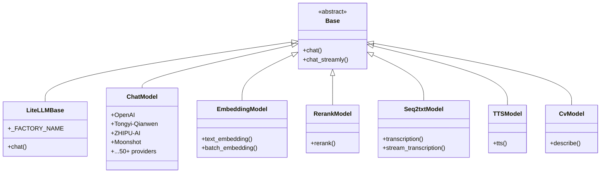

**支持的LLM厂商（部分）：**

| 厂商 | 支持模型类型 |
|------|-------------|
| OpenAI | LLM, Embedding, TTS, Speech2Text, Rerank |
| Azure-OpenAI | LLM, Embedding |
| Tongyi-Qianwen (阿里) | LLM, Embedding, TTS, Speech2Text, Rerank |
| ZHIPU-AI (智谱) | LLM, Embedding, Speech2Text |
| Moonshot (月之暗面) | LLM |
| DeepSeek | LLM |
| Anthropic (Claude) | LLM |
| Ollama | LLM, Embedding (本地部署) |
| HuggingFace | Embedding, Rerank |
| ... | 50+ 厂商 |

#### 4.2.3 检索流程

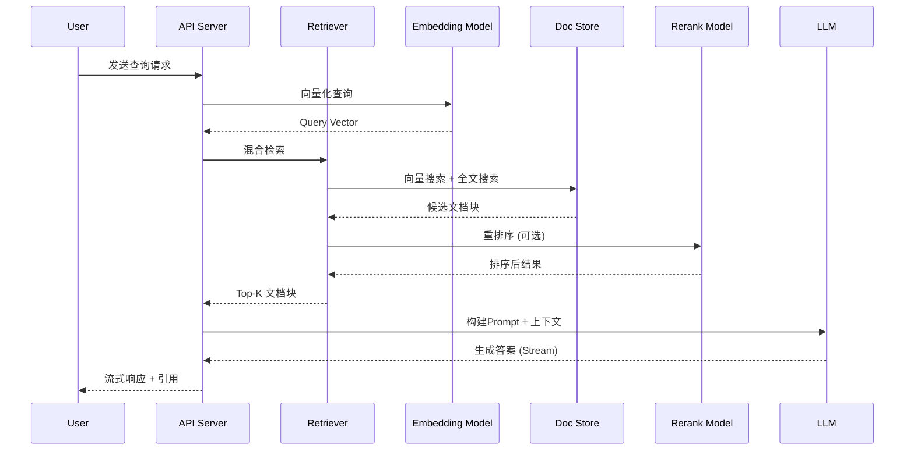

#### 4.2.4 GraphRAG (`rag/graphrag/`)

知识图谱增强的RAG：

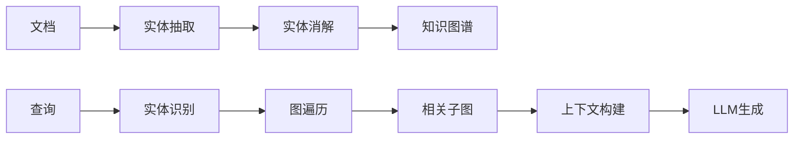

### 4.3 深度文档解析 (`deepdoc/`)

#### 4.3.1 架构设计

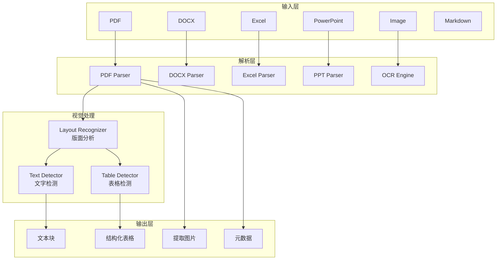

#### 4.3.2 支持的文档格式

| 类别 | 格式 |
|------|------|
| 文档 | PDF, DOCX, DOC, TXT, MD, HTML |
| 电子表格 | XLSX, XLS, CSV |
| 演示文稿 | PPTX, PPT |
| 图片 | PNG, JPG, JPEG, BMP, GIF, TIFF |
| 电子书 | EPUB |
| 其他 | JSON, EML |

### 4.4 Agent引擎 (`agent/`)

#### 4.4.1 Canvas架构

Agent基于可视化画布（Canvas）定义，使用DAG（有向无环图）表示工作流：

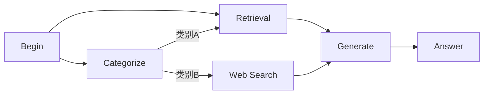

#### 4.4.2 组件库 (`agent/component/`)

| 组件 | 说明 |
|------|------|
| `Begin` | 入口节点，接收用户输入 |
| `Answer` | 输出节点，返回结果 |
| `Retrieval` | 知识库检索 |
| `Generate` | LLM生成 |
| `Categorize` | 意图分类 |
| `Relevant` | 相关性判断 |
| `RewriteQuestion` | 问题改写 |
| `Message` | 消息节点 |
| `KeywordExtract` | 关键词提取 |
| `Switch` | 条件分支 |
| `Concentrator` | 汇聚节点 |
| `Template` | 模板填充 |
| `Baidu` | 百度搜索 |
| `DuckDuckGo` | DuckDuckGo搜索 |
| `Wikipedia` | Wikipedia查询 |
| `GitHub` | GitHub搜索 |
| `ArXiv` | ArXiv论文搜索 |
| `Google` | Google搜索 |
| `GoogleScholar` | Google学术 |
| `Bing` | Bing搜索 |
| `PubMed` | PubMed医学文献 |
| `Code` | 代码执行（沙箱） |
| `Invoke` | 调用其他Agent |
| `AgentWithTools` | 工具调用Agent |

#### 4.4.3 DSL结构

```json
{
  "components": {
    "begin": {
      "obj": {
        "component_name": "Begin",
        "params": {}
      },
      "downstream": ["retrieval_0"],
      "upstream": []
    },
    "retrieval_0": {
      "obj": {
        "component_name": "Retrieval",
        "params": {
          "kb_ids": ["kb_xxx"],
          "top_n": 6
        }
      },
      "downstream": ["generate_0"],
      "upstream": ["begin"]
    },
    "generate_0": {
      "obj": {
        "component_name": "Generate",
        "params": {
          "llm_id": "gpt-4o",
          "prompt": "..."
        }
      },
      "downstream": ["answer_0"],
      "upstream": ["retrieval_0"]
    }
  },
  "globals": {
    "sys.query": "",
    "sys.user_id": "",
    "sys.conversation_turns": 0,
    "sys.files": []
  },
  "history": [],
  "path": []
}
```

### 4.5 文档存储层 (`common/doc_store/`)

#### 4.5.1 存储抽象

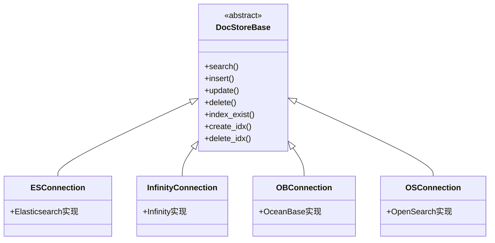

#### 4.5.2 索引字段设计

| 字段 | 类型 | 说明 |
|------|------|------|
| `id` | keyword | 分块ID |
| `doc_id` | keyword | 文档ID |
| `kb_id` | keyword | 知识库ID |
| `content_with_weight` | text | 带权重的内容 |
| `content_ltks` | text | 分词后的内容 |
| `q_vec` | dense_vector | 问题向量 |
| `q_1024_vec` | dense_vector | 1024维向量 |
| `page_num_int` | integer | 页码 |
| `position_int` | integer | 位置 |
| `top_int` | integer | 顶部坐标 |
| `create_time` | date | 创建时间 |
| `create_timestamp_flt` | float | 时间戳 |
| `important_kwd` | keyword | 重要关键词 |
| `tag_kwd` | keyword | 标签 |
| `knowledge_graph_kwd` | keyword | 知识图谱标记 |
| `raptor_kwd` | keyword | RAPTOR标记 |

---

## 5. 数据流设计

### 5.1 文档处理流程

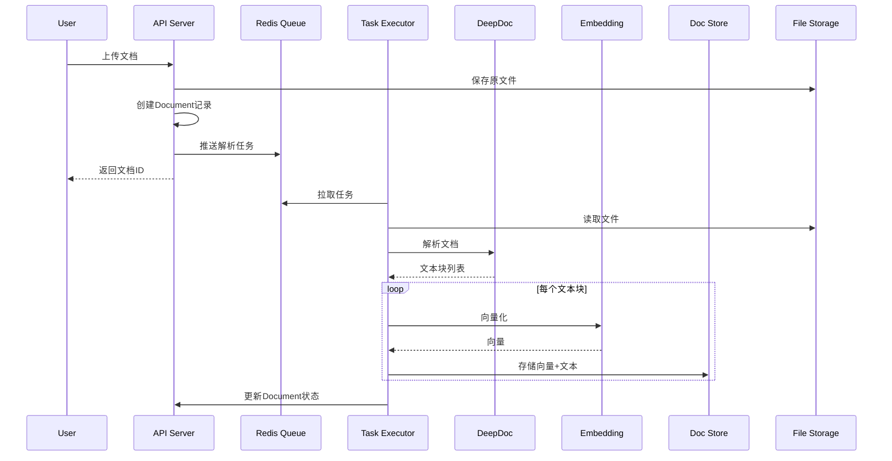

### 5.2 对话流程

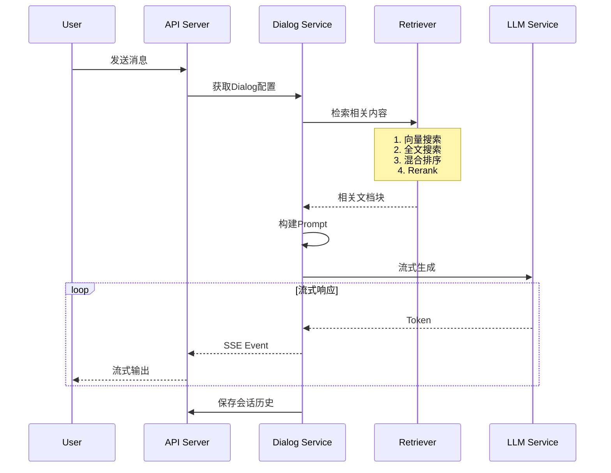

### 5.3 Agent执行流程

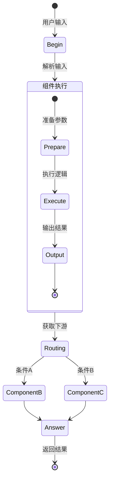

---

## 6. 配置管理

### 6.1 配置文件结构

```yaml
# conf/service_conf.yaml
ragflow:
  host: '0.0.0.0'
  http_port: 9380
  secret_key: 'your-secret-key'

mysql:
  name: 'rag_flow'
  user: 'root'
  password: 'infini_rag_flow'
  host: 'mysql'
  port: 3306

es:
  hosts: 'http://es01:9200'
  username: 'elastic'
  password: 'infini_rag_flow'

minio:
  user: 'rag_flow'
  password: 'infini_rag_flow'
  host: 'minio:9000'

redis:
  db: 1
  password: 'infini_rag_flow'
  host: 'redis'

user_default_llm:
  factory: 'OpenAI'
  api_key: 'sk-xxx'
  base_url: 'https://api.openai.com/v1'
```

### 6.2 环境变量

| 变量 | 说明 | 默认值 |
|------|------|--------|
| `DB_TYPE` | 数据库类型 | `mysql` |
| `DOC_ENGINE` | 文档引擎 | `elasticsearch` |
| `STORAGE_IMPL` | 对象存储 | `MINIO` |
| `MAX_CONTENT_LENGTH` | 最大上传大小 | 128MB |
| `DOC_BULK_SIZE` | 批量处理大小 | 4 |
| `EMBEDDING_BATCH_SIZE` | Embedding批次 | 16 |
| `REGISTER_ENABLED` | 允许注册 | 1 |
| `SANDBOX_ENABLED` | 启用代码沙箱 | 0 |
| `RAGFLOW_SECRET_KEY` | 安全密钥 | 自动生成 |

---

## 7. 安全设计

### 7.1 认证机制

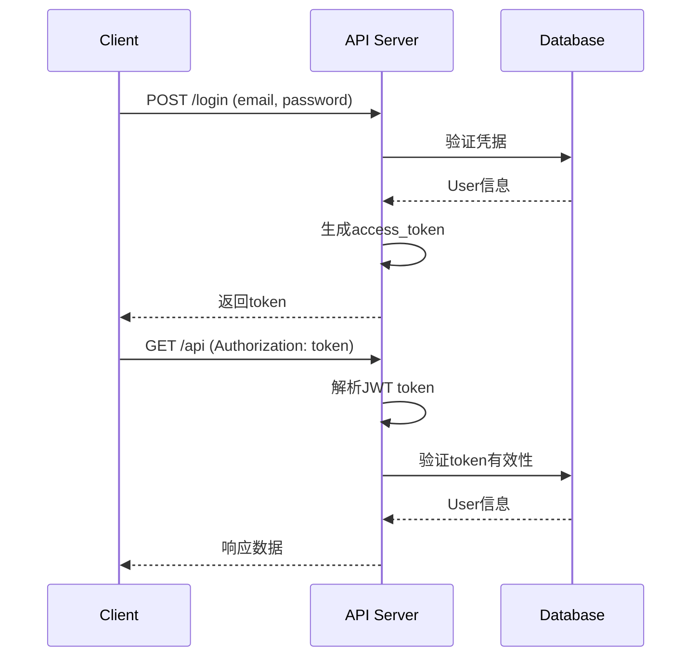

### 7.2 API Token认证

```python
# SDK API 使用 Bearer Token
Authorization: Bearer ragflow-xxxxx

# Token格式
{
    "tenant_id": "xxx",
    "token": "ragflow-xxxxx",
    "dialog_id": "可选，限定访问范围",
    "source": "agent|dialog"
}
```

### 7.3 多租户隔离

- 数据隔离：所有核心表都包含 `tenant_id` 字段
- 索引隔离：每个租户独立的向量索引
- 存储隔离：知识库按 `kb_id` 隔离存储桶

---

## 8. 扩展性设计

### 8.1 LLM厂商扩展

新增LLM厂商只需：

1. 在 `rag/llm/chat_model.py` 继承 `Base` 或 `LiteLLMBase`
2. 设置 `_FACTORY_NAME` 属性
3. 在 `conf/llm_factories.json` 添加配置

```python
class NewProviderChat(LiteLLMBase):
    _FACTORY_NAME = "NewProvider"
    
    def chat(self, system, history, gen_conf):
        # 实现聊天逻辑
        pass
```

### 8.2 文档解析器扩展

1. 在 `rag/app/` 创建新解析器
2. 继承基础解析逻辑
3. 注册到 `PARSERS` 配置

### 8.3 Agent组件扩展

1. 在 `agent/component/` 创建组件
2. 继承 `ComponentBase`
3. 实现 `_run()` 方法

```python
class MyComponent(ComponentBase):
    component_name = "MyComponent"
    
    def _run(self, history, **kwargs):
        # 组件逻辑
        return {"output": result}
```

### 8.4 数据连接器扩展

在 `common/data_source/` 实现新的连接器：

| 已支持 | 说明 |
|--------|------|
| GitHub | GitHub仓库同步 |
| Bitbucket | Bitbucket同步 |
| Notion | Notion页面同步 |
| Confluence | Confluence同步 |
| Google Drive | Google云盘 |
| OneDrive | 微软云盘 |
| Slack | Slack消息 |
| Airtable | Airtable表格 |
| ... | 更多数据源 |

---

## 9. 性能优化

### 9.1 检索优化

- **混合检索**：结合向量搜索和BM25全文搜索
- **Rerank**：使用重排序模型优化结果
- **缓存**：Redis缓存热点查询
- **分页**：大结果集分页返回

### 9.2 文档处理优化

- **异步处理**：Redis队列解耦
- **批量处理**：Embedding批次化
- **优先级队列**：支持任务优先级
- **断点续传**：任务失败可重试

### 9.3 并发处理

- **Quart异步**：全异步IO
- **连接池**：数据库连接池
- **线程池**：CPU密集型任务
- **Worker扩展**：多Task Executor实例

---

## 10. 监控与可观测性

### 10.1 日志系统

- 使用 Python `logging` 模块
- 支持日志级别配置
- 结构化日志输出

### 10.2 Langfuse集成

支持与Langfuse集成进行LLM调用追踪：

```python
# tenant_langfuse表配置
{
    "tenant_id": "xxx",
    "secret_key": "sk-lf-xxx",
    "public_key": "pk-lf-xxx",
    "host": "https://cloud.langfuse.com"
}
```

### 10.3 健康检查

```bash
# API健康检查
GET /v1/health

# Redis连接检查
GET /v1/system/redis_status
```

---

## 11. 部署架构

### 11.1 单机部署

```bash
docker compose -f docker/docker-compose.yml up -d
```

### 11.2 生产部署建议

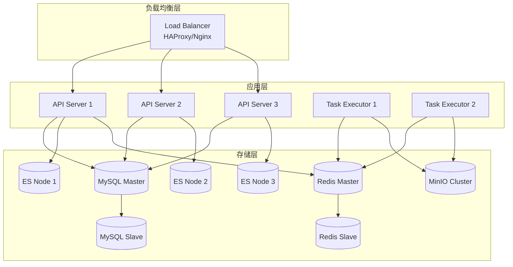

### 11.3 Kubernetes部署

提供Helm Chart支持：

```bash
helm install ragflow ./helm -f values.yaml
```

---

## 12. 版本兼容性

### 12.1 API版本

- 当前版本：`v1`
- 版本前缀：`/api/v1/`
- 内部接口：`/v1/`

### 12.2 数据库迁移

支持自动迁移，启动时检查表结构并应用变更。

---

## 附录

### A. 技术栈总览

| 层次 | 技术 |
|------|------|
| 前端 | React, TypeScript, UmiJS, Ant Design |
| API网关 | Nginx |
| 后端框架 | Quart (Async Flask), Python 3.10+ |
| ORM | Peewee |
| 任务队列 | Redis |
| 关系数据库 | MySQL / PostgreSQL / OceanBase |
| 向量数据库 | Elasticsearch / Infinity / OceanBase |
| 对象存储 | MinIO / S3 / Azure Blob / OSS |
| 容器化 | Docker, Docker Compose, Kubernetes |
| LLM集成 | LiteLLM + 原生SDK |

### B. 相关文档

- [数据库表结构设计](./2026-02-25-数据库表结构设计文档.md)
- [API接口文档](../api_docs/)
- [部署指南](./启动部署指南.md)
