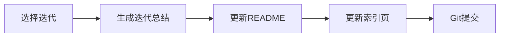

## User Input

```text
$ARGUMENTS
```

You **MUST** consider the user input before proceeding (if not empty).

## 流程概述

本工作流用于**迭代结束后的归档**，生成迭代总结并标记归档状态。



---

## 步骤

### 1. 确认归档迭代

**询问用户**（如未在 $ARGUMENTS 中提供）：

| 信息 | 示例 | 必填 |
|------|------|------|
| **迭代名称** | 2026-01-用户管理 | ✅ |
| **迭代摘要** | 完成用户登录、注册功能 | ✅ |

### 2. 扫描迭代内容

扫描 `docs/prototypes/{迭代}/` 目录，统计：
- 需求文档数量
- 原型数量
- 各功能完成状态

### 3. 生成/更新迭代 README

**文件路径**：`docs/prototypes/{迭代}/README.md`

```markdown
# {迭代名称} - 迭代归档

## 基本信息

| 项目 | 值 |
|------|-----|
| **迭代名称** | {迭代名称} |
| **归档日期** | {日期} |
| **状态** | 📦 已归档 |

## 迭代摘要

{迭代摘要描述}

## 功能清单

| 功能 | 澄清 | 需求 | 原型 |
|------|------|------|------|
| 用户登录 | ✅ | ✅ | ✅ |
| 用户注册 | ✅ | ✅ | ✅ |

## 文件目录

```
{迭代名称}/
├── README.md
├── requirements/
│   ├── 用户登录-澄清.md
│   ├── 用户登录-需求.md
│   ├── 用户注册-澄清.md
│   └── 用户注册-需求.md
└── html/
    ├── 用户登录-prototype.html
    └── 用户注册-prototype.html
```

## 原型预览

- [用户登录](./html/用户登录-prototype.html)
- [用户注册](./html/用户注册-prototype.html)

## 经验总结

{可选：本迭代的经验教训}

## 遗留问题

| 问题 | 状态 | 计划 |
|------|------|------|
| {问题1} | 待解决 | 下迭代处理 |
```

### 4. 更新索引页

在 `docs/prototypes/index.html` 中：
- 将该迭代标记为"已归档"
- 添加归档标识样式

### 5. 询问 Git 提交

```
是否提交到 Git？(y/n)
```

**如果是**：
```bash
git add docs/prototypes/
git commit -m "pm(归档): {迭代名称} - 迭代归档完成"
```

### 6. 输出报告

```markdown
# 📦 迭代归档完成

## 归档信息

| 项目 | 值 |
|------|-----|
| **迭代名称** | {迭代名称} |
| **归档日期** | {日期} |
| **功能数量** | {N} 个 |
| **原型数量** | {N} 个 |

## 文件清单

| 类型 | 数量 |
|------|------|
| 澄清文档 | {N} |
| 需求文档 | {N} |
| HTML原型 | {N} |

## 后续操作

- 开始新迭代: `/pm.clarify` 或 `/pm.prototype`
- 查看归档: `open docs/prototypes/{迭代}/README.md`
```

---

## Key Rules

- **完整性检查**：归档前检查所有功能是否完成
- **生成 README**：必须生成迭代 README.md
- **更新索引**：必须更新索引页的归档状态
- **Git 提交前询问**：不自动提交

## 使用示例

```bash
# 交互式
/pm.archive

# 指定迭代
/pm.archive 2026-01-用户管理

# 带摘要
/pm.archive 迭代:2026-01-用户管理 摘要:完成用户登录注册功能
```
