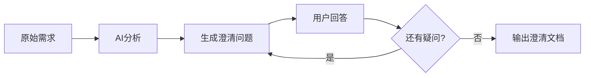

## User Input

```text
$ARGUMENTS
```

You **MUST** consider the user input before proceeding (if not empty).

## 流程概述

本工作流用于对产品经理收到的**模糊或不完整需求**进行澄清，通过结构化提问确保需求理解一致。



---

## 步骤

### 1. 检测 Git 环境

```bash
# 检测 Git 是否安装
git --version
```

**如果未安装**：
```bash
# Mac 安装
xcode-select --install
```

**如果未配置用户信息**：
```
请配置 Git 用户信息：
git config --global user.name "你的姓名"
git config --global user.email "你的邮箱"
```

### 2. 确认基本信息

**询问用户**（如未在 $ARGUMENTS 中提供）：

| 信息 | 示例 | 必填 |
|------|------|------|
| **迭代名称** | 2026-01-用户管理 | ✅ |
| **功能名称** | 用户登录 | ✅ |
| **产品经理** | 张三 | ✅ |

### 3. 获取原始需求

请用户描述原始需求，可以是：
- 用户/客户的原话
- 会议记录
- 邮件内容
- 口头描述

### 4. 分析并生成澄清问题

AI 分析需求，从以下维度生成澄清问题：

| 维度 | 问题示例 |
|------|----------|
| **目标用户** | 这个功能是给谁用的？内部员工还是外部用户？ |
| **使用场景** | 用户在什么情况下会使用这个功能？ |
| **核心流程** | 用户完成这个操作的主要步骤是什么？ |
| **输入输出** | 需要用户输入什么？系统输出什么？ |
| **业务规则** | 有什么限制条件或业务规则？ |
| **异常情况** | 如果出错了怎么处理？ |
| **性能要求** | 对响应时间、并发量有要求吗？ |
| **优先级** | 这个功能的优先级是？MVP 必须有还是后续迭代？ |

**一次列出所有问题，用户可以批量回答。**

### 5. 记录用户回答

用户回答后，AI 整理问答记录。

如果回答中仍有模糊点，可以追问。

### 6. 输出澄清文档

**创建目录**：
```bash
mkdir -p docs/prototypes/{迭代名称}/requirements
```

**输出文件**：`docs/prototypes/{迭代名称}/requirements/{功能名}-澄清.md`

### 7. 询问 Git 提交

```
是否提交到 Git？(y/n)
```

**如果是**：
```bash
git add docs/prototypes/{迭代名称}/requirements/{功能名}-澄清.md
git commit -m "pm(澄清): {功能名} - 需求澄清完成"
```

### 8. 输出报告

```markdown
# ✅ 需求澄清完成

## 文件信息

| 项目 | 值 |
|------|-----|
| **澄清文档** | `docs/prototypes/{迭代}/{功能名}-澄清.md` |
| **状态** | 澄清完成 |

## 下一步

执行 `/pm.spec` 将澄清结果整理为结构化需求文档。
```

---

## 产出物模板

```markdown
# {功能名} - 需求澄清

## 基本信息

| 项目 | 值 |
|------|-----|
| **功能名称** | {功能名} |
| **所属迭代** | {迭代名称} |
| **产品经理** | {PM} |
| **澄清日期** | {日期} |
| **状态** | ✅ 澄清完成 |

## 原始需求

```
{用户最初的需求描述，保持原样}
```

## 澄清问答

### Q1: {问题1}
**A**: {用户回答}

### Q2: {问题2}
**A**: {用户回答}

### Q3: {问题3}
**A**: {用户回答}

## 澄清结论

{经过澄清后，AI 总结的需求理解}

## 待确认项

- [ ] {仍需确认的点1}
- [ ] {仍需确认的点2}

## 关联文档

- [需求规格](./{功能名}-需求.md)（待生成）
- [HTML原型](../html/{功能名}-prototype.html)（待生成）
```

---

## Key Rules

- **保持原始需求原样**：不要修改用户的原始描述
- **问题要具体**：避免过于宽泛的问题
- **一次列出所有问题**：用户批量回答，减少交互次数
- **允许追问**：如果回答仍不清楚，可以继续追问
- **Git 提交前询问**：不自动提交

## 使用示例

```bash
# 交互式
/pm.clarify

# 带参数
/pm.clarify 迭代:2026-01-用户管理 功能:用户登录 需求:客户说要做一个登录页面
```
