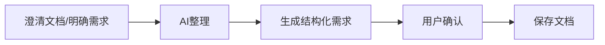

## User Input

```text
$ARGUMENTS
```

You **MUST** consider the user input before proceeding (if not empty).

## 流程概述

本工作流将澄清后的需求（或明确的需求描述）整理为**结构化需求文档**。



---

## 步骤

### 1. 检测 Git 环境

同 `/pm.clarify`，检测并确保 Git 可用。

### 2. 确认基本信息

**询问用户**（如未在 $ARGUMENTS 中提供）：

| 信息 | 示例 | 必填 |
|------|------|------|
| **迭代名称** | 2026-01-用户管理 | ✅ |
| **功能名称** | 用户登录 | ✅ |
| **产品经理** | 张三 | ✅ |

### 3. 加载上下文

**检查是否有澄清文档**：
```
docs/prototypes/{迭代}/requirements/{功能名}-澄清.md
```

- **有澄清文档**：基于澄清文档整理
- **无澄清文档**：请用户直接描述需求

### 4. 整理需求文档

AI 将需求整理为结构化格式，包含：

| 章节 | 内容 |
|------|------|
| 基本信息 | 功能名、迭代、PM、日期、状态 |
| 需求背景 | 为什么要做这个功能 |
| 目标用户 | 谁用、什么场景 |
| 功能描述 | 详细功能说明 |
| 用户故事 | 用户视角的需求描述 |
| 业务规则 | 限制条件、计算规则等 |
| 验收标准 | 功能完成的判定标准 |
| 边界与异常 | 异常场景处理 |

### 5. 用户确认

展示生成的需求文档，请用户确认或提出修改。

### 6. 保存文档

**输出文件**：`docs/prototypes/{迭代名称}/requirements/{功能名}-需求.md`

### 7. 询问 Git 提交

```
是否提交到 Git？(y/n)
```

**如果是**：
```bash
git add docs/prototypes/{迭代}/requirements/{功能名}-需求.md
git commit -m "pm(需求): {功能名} - 需求整理完成"
```

### 8. 输出报告

```markdown
# ✅ 需求整理完成

## 文件信息

| 项目 | 值 |
|------|-----|
| **需求文档** | `docs/prototypes/{迭代}/{功能名}-需求.md` |
| **状态** | 需求已整理 |

## 下一步

执行 `/pm.prototype` 生成可交互 HTML 原型。
```

---

## 产出物模板

```markdown
# {功能名} - 需求规格

## 基本信息

| 项目 | 值 |
|------|-----|
| **功能名称** | {功能名} |
| **所属迭代** | {迭代名称} |
| **产品经理** | {PM} |
| **创建日期** | {日期} |
| **状态** | 草稿 / 已确认 |

## 需求背景

{为什么要做这个功能？解决什么问题？带来什么价值？}

## 目标用户

| 用户角色 | 特征 | 使用场景 |
|----------|------|----------|
| {角色1} | {特征} | {场景} |
| {角色2} | {特征} | {场景} |

## 功能描述

{详细描述功能要实现什么}

### 核心功能

1. **{功能点1}**：{描述}
2. **{功能点2}**：{描述}

### 功能边界

- ✅ 包含：{在范围内的}
- ❌ 不包含：{不在范围内的}

## 用户故事

- 作为**{角色}**，我希望**{功能}**，以便**{价值}**
- 作为**{角色}**，我希望**{功能}**，以便**{价值}**

## 业务规则

| 编号 | 规则 | 说明 |
|------|------|------|
| BR01 | {规则1} | {说明} |
| BR02 | {规则2} | {说明} |

## 验收标准

- [ ] AC01: {验收标准1}
- [ ] AC02: {验收标准2}
- [ ] AC03: {验收标准3}

## 边界与异常

| 场景 | 触发条件 | 处理方式 |
|------|----------|----------|
| {异常1} | {条件} | {处理} |
| {异常2} | {条件} | {处理} |

## 非功能需求

| 类型 | 要求 |
|------|------|
| 性能 | {如：页面加载 < 3s} |
| 安全 | {如：密码加密存储} |
| 兼容 | {如：支持 Chrome/Safari} |

## 关联文档

- [需求澄清](./{功能名}-澄清.md)
- [HTML原型](../html/{功能名}-prototype.html)（待生成）

## 变更记录

| 日期 | 版本 | 变更内容 | 变更人 |
|------|------|----------|--------|
| {日期} | V1.0 | 初始版本 | {PM} |
```

---

## Key Rules

- **结构化输出**：必须按模板格式输出
- **用户故事格式**：作为{角色}，我希望{功能}，以便{价值}
- **验收标准可测**：每条验收标准必须可验证
- **Git 提交前询问**：不自动提交

## 使用示例

```bash
# 交互式（基于已有澄清文档）
/pm.spec

# 带参数
/pm.spec 迭代:2026-01-用户管理 功能:用户登录

# 直接输入需求（跳过澄清）
/pm.spec 功能:用户登录 需求:实现账号密码登录，支持记住密码
```
