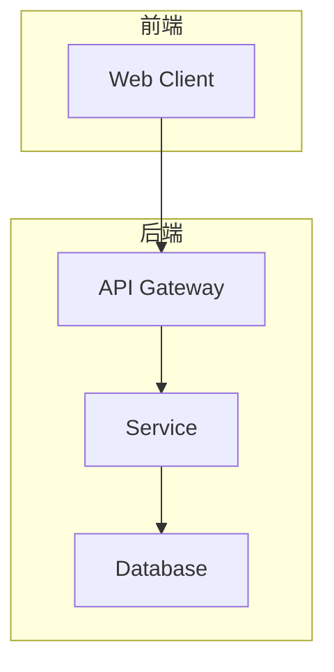

## User Input

```text
$ARGUMENTS
```

You **MUST** consider the user input before proceeding (if not empty). This should contain your tech stack choices.

## 流程概述

本工作流对应开发流程 **③ 架构设计**，产出物为 `{功能}-架构设计-V{版本}.md`，归档至 `docs/architecture/`。

### 步骤

1. **识别当前功能**：
   - 获取当前分支名
   - 在 `.specify/specs/` 中找到对应 spec

2. **加载上下文**：
   - 读取需求规格 `spec.md`
   - 读取产品设计 `product.md`
   - 读取 `.specify/memory/constitution.md`
   - 加载 `.specify/templates/architecture-template.md`（如存在）

3. **技术研究**（Phase 0）：
   - 从需求中提取技术未知项
   - 研究技术选型
   - 生成 `.specify/specs/<feature>/research.md`

4. **架构设计**（Phase 1）：
   
   ### 核心内容
   - **系统架构**：整体架构图（C4 Model 或 Mermaid）
   - **技术选型**：框架、语言、工具及选型理由
   - **数据模型**：实体、关系、约束
   - **API 设计**：接口定义、请求/响应格式
   - **安全设计**：认证、授权、数据保护
   - **性能设计**：缓存策略、并发处理
   - **部署架构**：环境配置、容器化方案

5. **生成设计文档**：
   - `data-model.md`：数据模型详细设计
   - `contracts/`：API 契约文件
   - `quickstart.md`：快速启动指南

6. **版本管理**：
   - 首次创建为 V1
   - 重大架构变更递增版本号

7. **保存并归档**：
   - 写入 `.specify/specs/<feature>/architecture.md`（工作副本）
   - 归档到 `docs/architecture/{功能}-架构设计-V{版本}.md`

8. **报告**：输出架构设计路径、版本号、生成的辅助文档

## 产出物模板

```markdown
# {功能名称} - 架构设计 V{版本}

## 1. 系统架构


## 2. 技术选型
| 层级 | 技术 | 选型理由 |
|------|------|----------|
| 前端 | ... | ... |
| 后端 | ... | ... |
| 数据库 | ... | ... |

## 3. 数据模型
[实体关系图和字段说明]

## 4. API 设计
| 接口 | 方法 | 路径 | 说明 |
|------|------|------|------|
| ... | ... | ... | ... |

## 5. 安全设计
[认证、授权、数据保护方案]

## 6. 性能设计
[缓存、并发、扩展方案]

## 7. 部署架构
[环境配置、容器化方案]
```

## Key Rules

- 技术选型必须有明确理由
- 数据模型必须包含约束和索引设计
- API 设计遵循 RESTful 或明确的规范
- 使用 C4 Model 时需与 `/speckit.c4model` 保持一致
- **必须归档到 `docs/architecture/`**
