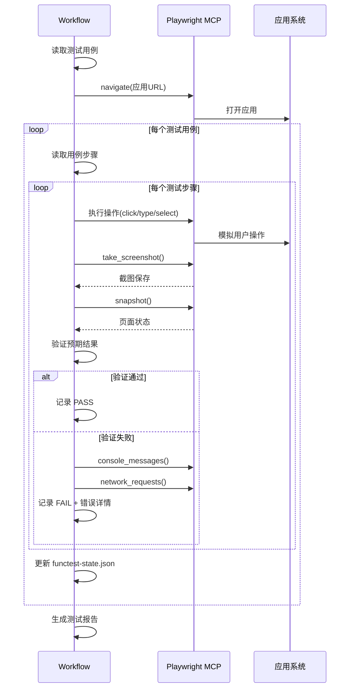

## User Input

```text
$ARGUMENTS
```

You **MUST** consider the user input before proceeding (if not empty).

**支持的参数**：
- `--resume` - 从上次中断处继续
- `--case <TC-XXX>` - 只执行指定测试用例
- `--priority <P0|P1|P2>` - 只执行指定优先级的用例
- `--record` - 开启视频录制
- `--env <dev|test|prod>` - 指定测试环境（默认 dev）

## 流程概述

本工作流用于**自动化执行功能测试**，基于测试用例文档，使用 Playwright MCP 浏览器自动化工具进行模拟点击、截图、录视频，验证功能是否符合预期。

> **核心原则**：所有测试必须有可视化证据（截图/视频）
> 
> ⚠️ **防遗漏原则**：每步必须读写状态文件，AI 不得依赖记忆

### 前置条件

- 已完成 `/speckit.testcase`，存在测试用例文档
- 应用服务可正常启动
- Playwright MCP 浏览器代理可用

### 步骤

1. **加载上下文并初始化**：
   ```
   a. 读取 `.specify/memory/constitution.md`
   b. 读取 `.specify/specs/<feature>/testcase.md` 或 `docs/test/{功能}-测试用例.md`
   c. 读取/创建 `docs/test/{功能}-functest-state.json`（测试状态文件）
   d. 如果是 --resume，从上次状态继续
   e. 如果是 --case，过滤只保留指定用例
   f. 如果是 --priority，过滤只保留指定优先级用例
   ```

2. **启动应用服务**：
   ```bash
   # 检查服务是否已运行
   // turbo
   curl -s http://localhost:8000/ping || (
     cd backend && make dev &
     sleep 10  # 等待服务启动
   )
   
   # 前端开发服务（如需要）
   // turbo
   curl -s http://localhost:5173 || (
     cd frontend && npm run dev &
     sleep 5
   )
   ```

3. **初始化浏览器环境**：
   ```javascript
   // 导航到应用首页
   await mcp1_browser_navigate({ url: "http://localhost:5173" });
   
   // 如果需要录制视频
   if (args.record) {
     // Playwright 自动录制模式
   }
   
   // 截图初始状态
   await mcp1_browser_take_screenshot({
     filename: "000-initial.png",
     type: "png"
   });
   ```

4. **执行测试前校验**：
   ```
   a. 从 functest-state.json 读取 pending_cases 列表
   b. 统计待测试用例数
   c. 输出测试计划：
      "本次将执行 X 个测试用例，预计需要 Y 分钟"
      "待测试用例列表：[前10个]..."
   d. 等待用户确认后继续
   ```

5. **执行测试用例**（核心循环）：
   
   ```python
   checkpoint_counter = 0
   
   for test_case in pending_cases:
       
       # ===== 步骤 A: 读取状态 =====
       state = read_file("functest-state.json")
       current_case = test_case
       
       # ===== 步骤 B: 执行前置条件 =====
       for precondition in current_case.preconditions:
           execute_precondition(precondition)
       
       screenshot(f"{current_case.id}-00-precondition.png")
       
       # ===== 步骤 C: 执行测试步骤 =====
       step_results = []
       for step_index, step in enumerate(current_case.steps):
           
           # 执行操作
           result = execute_step(step.action)
           
           # 截图当前状态
           screenshot(f"{current_case.id}-{step_index:02d}-{step.name}.png")
           
           # 验证预期结果
           actual_result = get_current_state()
           is_pass = verify_expected(actual_result, step.expected)
           
           step_results.append({
               "step": step_index,
               "action": step.action,
               "expected": step.expected,
               "actual": actual_result,
               "status": "PASS" if is_pass else "FAIL",
               "screenshot": f"{current_case.id}-{step_index:02d}-{step.name}.png"
           })
           
           # 如果步骤失败，记录详细信息
           if not is_pass:
               screenshot(f"{current_case.id}-{step_index:02d}-FAIL.png")
               console_logs = get_console_logs()
               network_errors = get_network_errors()
               record_failure_details(console_logs, network_errors)
       
       # ===== 步骤 D: 判定用例结果 =====
       case_status = "PASS" if all(r["status"] == "PASS" for r in step_results) else "FAIL"
       
       # ===== 步骤 E: 更新状态（必须！）=====
       state.completed_cases.append({
           "id": current_case.id,
           "name": current_case.name,
           "status": case_status,
           "steps": step_results,
           "duration": elapsed_time,
           "timestamp": now()
       })
       state.pending_cases.remove(current_case.id)
       state.stats.total += 1
       state.stats.passed += 1 if case_status == "PASS" else 0
       state.stats.failed += 1 if case_status == "FAIL" else 0
       state.last_update = now()
       write_file("functest-state.json", state)  # ← 每步必须写入！
       
       # ===== 步骤 F: 检查点 =====
       checkpoint_counter += 1
       if checkpoint_counter >= 3:
           save_checkpoint()
           checkpoint_counter = 0
           output_progress()
   ```

6. **每 3 个用例输出进度**：
   ```markdown
   ## 测试进度报告
   
   | 项目 | 数值 |
   |------|------|
   | 已测试 | 12 |
   | 待测试 | 8 |
   | 通过 | 10 |
   | 失败 | 2 |
   | **通过率** | **83.3%** |
   
   ### 刚完成的 3 个用例
   1. ✅ TC-001: 用户登录成功
   2. ✅ TC-002: 用户登录失败-密码错误
   3. ❌ TC-003: 用户登录失败-验证码错误 (实际结果与预期不符)
   
   ### 接下来 3 个用例
   1. ⬜ TC-004: 新建预算草稿
   2. ⬜ TC-005: 编辑预算草稿
   3. ⬜ TC-006: 提交预算审批
   
   是否继续？(y/n)
   ```

7. **处理特殊场景**：
   
   | 场景 | 处理 |
   |------|------|
   | 元素未找到 | 等待 5s 重试，仍失败则标记 BLOCKED |
   | 弹窗阻挡 | 处理弹窗后继续 |
   | 页面加载超时 | 重试 3 次，仍失败则标记 BLOCKED |
   | 接口报错 | 截图记录，标记 FAIL 并记录错误信息 |

8. **测试完成后校验**：
   ```
   a. 读取 functest-state.json
   b. 统计测试结果
   c. 对比：
      - 已测试数 = completed_cases 长度
      - 待测试数 = pending_cases 长度
      - 通过率 = passed / total
   d. 如果 待测试数 > 0：
      - 列出所有遗漏用例
      - 询问是否继续测试
   e. 如果 通过率 < 100%：
      - 列出所有失败用例
      - 提供失败原因分析
   ```

9. **生成测试报告**：
   - 更新 `docs/test/{功能}-测试报告.md`
   - 生成 `docs/test/{功能}-functest-evidence/` 目录存放截图
   - 更新 `functest-state.json` 最终状态

10. **清理**：
    ```
    a. 询问是否停止开发服务
    b. 关闭浏览器（可选）
    c. 输出测试总结
    ```

## 输出物

| 文件 | 说明 |
|------|------|
| `functest-state.json` | 测试状态文件（实时更新） |
| `{功能}-测试报告.md` | 测试报告（含结果） |
| `{功能}-functest-evidence/` | 截图和视频证据目录 |
| `checkpoints/*.json` | 检查点文件 |

## Playwright 测试操作序列



## Playwright 操作示例

### 1. 表单填写测试

```javascript
// 测试用例: TC-001 用户登录
// 步骤 1: 输入用户名
await mcp1_browser_type({
  ref: "input[name='username']",
  text: "testuser",
  element: "用户名输入框"
});

// 步骤 2: 输入密码
await mcp1_browser_type({
  ref: "input[name='password']",
  text: "password123",
  element: "密码输入框"
});

// 步骤 3: 点击登录
await mcp1_browser_click({
  ref: "button[type='submit']",
  element: "登录按钮"
});

// 等待响应
await mcp1_browser_wait_for({ time: 2 });

// 截图验证
await mcp1_browser_take_screenshot({
  filename: "TC-001-03-login-result.png",
  type: "png"
});

// 验证预期结果：跳转到首页
const snapshot = await mcp1_browser_snapshot();
// 检查是否包含首页元素
```

### 2. 列表操作测试

```javascript
// 测试用例: TC-010 新建预算
// 步骤 1: 点击新建按钮
await mcp1_browser_click({
  ref: "button:has-text('新建')",
  element: "新建预算按钮"
});

await mcp1_browser_wait_for({ time: 1 });
await mcp1_browser_take_screenshot({
  filename: "TC-010-01-new-modal.png"
});

// 步骤 2: 填写表单
await mcp1_browser_fill_form({
  fields: [
    { ref: "input#name", type: "textbox", name: "预算名称", value: "测试预算" },
    { ref: "select#department", type: "combobox", name: "部门", value: "研发部" },
    { ref: "input#amount", type: "textbox", name: "金额", value: "10000" }
  ]
});

await mcp1_browser_take_screenshot({
  filename: "TC-010-02-form-filled.png"
});

// 步骤 3: 提交
await mcp1_browser_click({
  ref: "button:has-text('确定')",
  element: "确定按钮"
});

await mcp1_browser_wait_for({ time: 2 });
await mcp1_browser_take_screenshot({
  filename: "TC-010-03-submit-result.png"
});
```

### 3. 验证预期结果

```javascript
// 获取页面快照
const snapshot = await mcp1_browser_snapshot();

// 验证方式 1: 检查元素存在
const hasSuccessMessage = snapshot.includes("操作成功");

// 验证方式 2: 检查 URL
const currentUrl = await mcp1_browser_evaluate({
  function: "() => window.location.href"
});
const urlCorrect = currentUrl.includes("/budget/list");

// 验证方式 3: 检查控制台错误
const consoleMessages = await mcp1_browser_console_messages({
  level: "error"
});
const noErrors = consoleMessages.length === 0;

// 验证方式 4: 检查网络请求
const networkRequests = await mcp1_browser_network_requests({
  includeStatic: false
});
const apiSuccess = networkRequests.every(r => r.status < 400);
```

### 4. 错误处理

```javascript
// 捕获失败详情
async function captureFailureDetails(caseId, stepIndex) {
  // 截图
  await mcp1_browser_take_screenshot({
    filename: `${caseId}-${stepIndex}-FAIL.png`,
    fullPage: true
  });
  
  // 控制台日志
  const consoleLogs = await mcp1_browser_console_messages({
    level: "error"
  });
  
  // 网络请求
  const networkRequests = await mcp1_browser_network_requests({
    includeStatic: false
  });
  
  // 过滤失败的请求
  const failedRequests = networkRequests.filter(r => r.status >= 400);
  
  return {
    screenshot: `${caseId}-${stepIndex}-FAIL.png`,
    consoleLogs,
    failedRequests
  };
}
```

## 测试状态文件格式

```json
{
  "feature": "用户管理",
  "test_case_file": "docs/test/用户管理-测试用例.md",
  "environment": "dev",
  "base_url": "http://localhost:5173",
  "started_at": "2026-01-24T09:00:00Z",
  "last_update": "2026-01-24T09:30:00Z",
  "stats": {
    "total": 20,
    "passed": 15,
    "failed": 3,
    "blocked": 1,
    "pending": 1
  },
  "current_case": "TC-019",
  "pending_cases": ["TC-019", "TC-020"],
  "completed_cases": [
    {
      "id": "TC-001",
      "name": "用户登录成功",
      "status": "PASS",
      "duration": 5.2,
      "steps": [
        {
          "step": 1,
          "action": "输入用户名",
          "expected": "用户名显示在输入框",
          "actual": "用户名正确显示",
          "status": "PASS",
          "screenshot": "TC-001-01-username.png"
        }
      ],
      "timestamp": "2026-01-24T09:05:00Z"
    }
  ],
  "checkpoints": [
    {
      "id": "checkpoint-001",
      "timestamp": "2026-01-24T09:15:00Z",
      "completed_count": 10
    }
  ]
}
```

## 测试证据目录结构

```
docs/test/{功能}-functest-evidence/
├── TC-001/
│   ├── TC-001-00-precondition.png
│   ├── TC-001-01-input-username.png
│   ├── TC-001-02-input-password.png
│   └── TC-001-03-login-result.png
├── TC-002/
│   ├── TC-002-00-precondition.png
│   ├── TC-002-01-input-wrong-password.png
│   ├── TC-002-02-FAIL.png
│   └── TC-002-error-details.json
├── videos/              # 如果开启录制
│   └── full-test-run.webm
└── summary.json         # 测试汇总
```

## Key Rules

- **100% 用例覆盖**：所有待测试用例必须执行
- **每步截图**：每个测试步骤必须截图留证
- **状态实时更新**：每完成一个用例立即更新状态文件
- **失败详情**：失败用例必须记录控制台日志和网络错误
- **可恢复**：支持从中断处继续执行
- **视频录制**：关键流程建议录制视频
- 遵循 `constitution.md` 测试规约
- **必须归档到 `docs/test/`**
