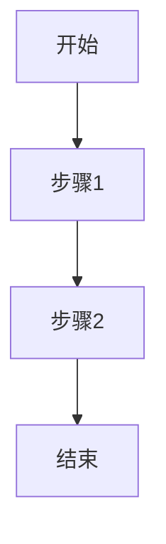

## User Input

```text
$ARGUMENTS
```

You **MUST** consider the user input before proceeding (if not empty).

## 流程概述

本工作流对应开发流程 **② 产品设计**，产出物为 `{功能}-产品设计-V{版本}.md`，归档至 `docs/product/`。

### 步骤

1. **识别当前功能**：
   - 获取当前分支名
   - 在 `.specify/specs/` 中找到对应 spec

2. **加载上下文**：
   - 读取需求规格 `spec.md`
   - 读取 `.specify/memory/constitution.md`
   - 加载 `.specify/templates/product-template.md`（如存在）

3. **生成产品设计**：
   
   ### 核心内容
   - **功能概述**：一句话描述功能价值
   - **目标用户**：用户画像、使用场景
   - **用户流程**：核心操作流程图（Mermaid）
   - **功能清单**：详细功能点列表
   - **界面原型**：关键页面描述/线框图
   - **交互设计**：用户交互行为说明
   - **边界情况**：异常场景处理

4. **版本管理**：
   - 首次创建为 V1
   - 迭代更新递增版本号

5. **保存并归档**：
   - 写入 `.specify/specs/<feature>/product.md`（工作副本）
   - 归档到 `docs/product/{功能}-产品设计-V{版本}.md`

6. **报告**：输出产品设计路径、版本号

## 产出物模板

```markdown
# {功能名称} - 产品设计 V{版本}

## 1. 功能概述
[一句话描述功能价值]

## 2. 目标用户
| 用户角色 | 特征 | 使用场景 |
|----------|------|----------|
| ... | ... | ... |

## 3. 用户流程


## 4. 功能清单
- [ ] 功能点 1
- [ ] 功能点 2

## 5. 界面原型
[关键页面描述]

## 6. 交互设计
[用户交互行为说明]

## 7. 边界情况
| 场景 | 处理方式 |
|------|----------|
| ... | ... |
```

## Key Rules

- 以用户视角描述，避免技术术语
- 用户流程必须使用 Mermaid 图
- 功能清单必须完整且可追溯到需求
- **必须归档到 `docs/product/`**
