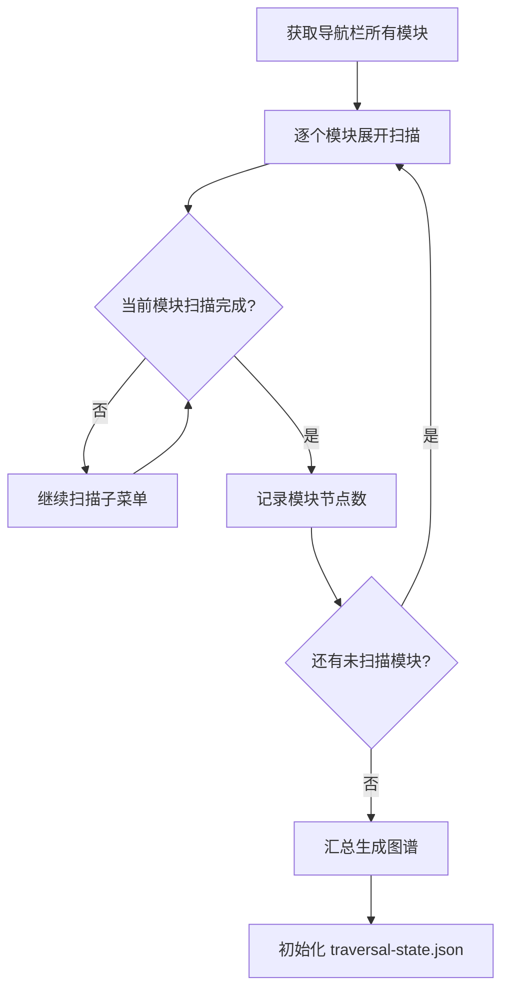
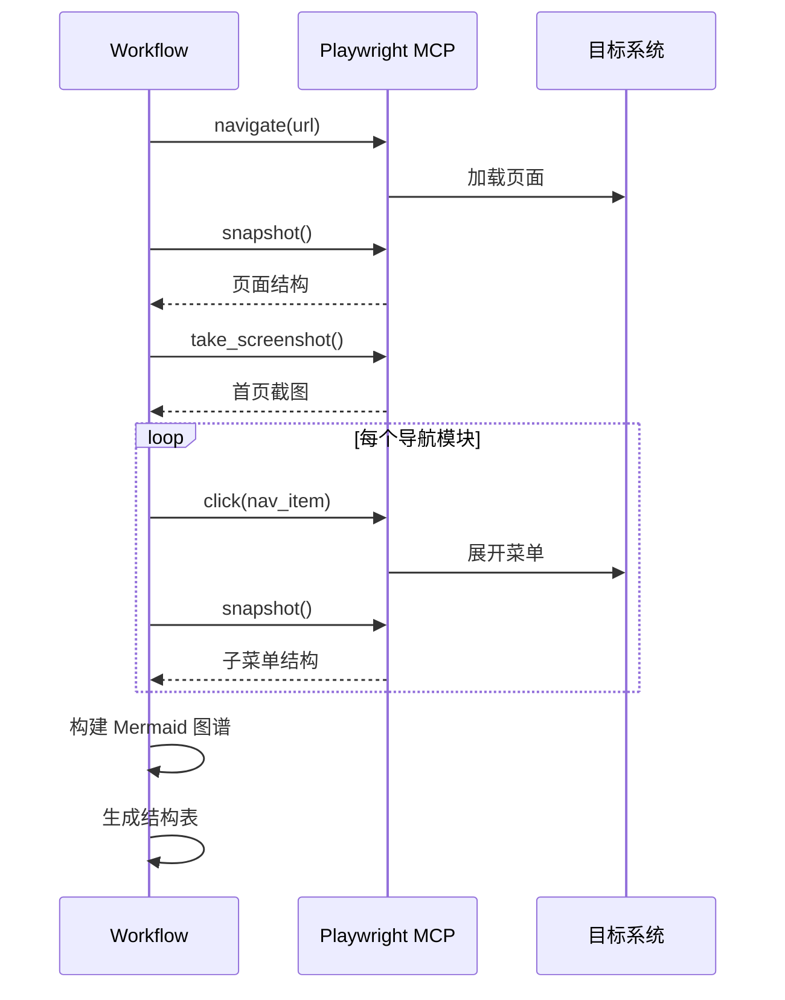
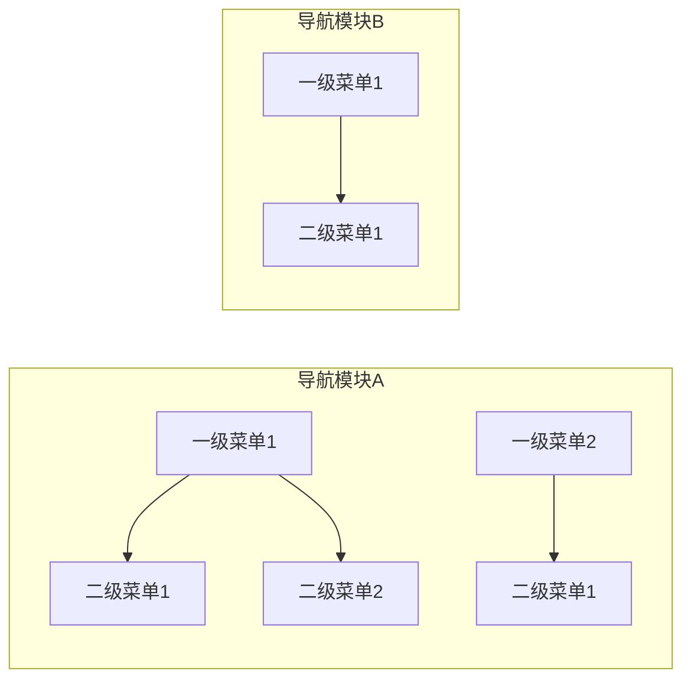

## User Input

```text
$ARGUMENTS
```

You **MUST** consider the user input before proceeding (if not empty).

## 流程概述

本工作流用于逆向工程的**第一阶段：层级扫描**，通过 Playwright MCP 浏览器代理扫描目标系统界面，构建可视化层级图谱。

> **核心原则**：所见即所得，无可视化证据不记录

### 前置条件

- 目标系统 URL 和登录凭证
- Playwright MCP 浏览器代理可用

### 步骤

1. **初始化配置**：
   ```bash
   # 创建输出目录
   mkdir -p docs/reverse/{系统名称}-{日期}
   mkdir -p docs/reverse/{系统名称}-{日期}/screenshots
   ```

2. **加载规约**：
   - 读取 `.specify/memory/reverse-engineering-constitution.md`

3. **启动浏览器并登录**：
   ```
   mcp1_browser_navigate → 目标系统 URL
   mcp1_browser_snapshot → 识别登录表单
   mcp1_browser_type → 输入凭证
   mcp1_browser_click → 点击登录
   mcp1_browser_wait_for → 等待登录完成
   ```

4. **扫描导航结构**：
   
   a. **截取首页全貌**：
   ```
   mcp1_browser_take_screenshot → 首页截图
   mcp1_browser_snapshot → 获取页面结构
   ```
   
   b. **识别导航栏模块**：
   - 从 snapshot 中提取所有可见的导航项
   - 记录每个导航项的名称和 ref
   
   c. **逐层展开扫描**：
   ```
   对于每个导航模块:
       mcp1_browser_click → 点击展开
       mcp1_browser_snapshot → 获取子菜单
       记录一级菜单项
       
       对于每个一级菜单:
           mcp1_browser_click → 点击展开
           mcp1_browser_snapshot → 获取二级菜单
           记录二级菜单项
   ```

5. **构建层级图谱**：
   - 使用 Mermaid flowchart 格式
   - 为每个节点分配唯一标识
   - 写入 `hierarchy-graph.md`

6. **生成层级结构表**：
   - 使用模板 `.specify/templates/reverse-hierarchy-structure.md`
   - 写入 `hierarchy-structure.md`

7. **报告**：输出扫描结果统计

## 输出物

| 文件 | 说明 |
|------|------|
| `hierarchy-graph.md` | Mermaid 层级图谱 |
| `hierarchy-structure.md` | 层级结构表（含节点标识） |
| `traversal-state.json` | 遍历状态文件（初始化） |
| `screenshots/首页_001.png` | 系统首页截图 |

## 防遗漏：分模块扫描策略

对于大系统，必须分模块进行扫描，确保不遗漏：



### 扫描清单确认

扫描完成后，必须输出并确认：

```markdown
## 扫描结果确认

### 导航模块清单（请逐一确认）
- [ ] 客户管理 (12 个子节点)
- [ ] 订单中心 (8 个子节点)
- [ ] 系统设置 (15 个子节点)
- [ ] ...

### 统计
| 项目 | 数量 |
|------|------|
| 导航模块 | X |
| 一级菜单 | X |
| 二级菜单 | X |
| 功能点 | X |
| **总节点数** | **N** |

⚠️ **请确认以上模块是否完整，如有遗漏请指出**
```

## Playwright 操作序列



## 层级图谱模板



## Key Rules

- **所见即所得**：只记录 snapshot 中实际可见的元素
- **不捏造**：未在界面显示的菜单项不纳入图谱
- **唯一标识**：每个节点必须有唯一标识
- **截图留证**：关键页面必须截图
- 遵循 `reverse-engineering-constitution.md` 规约
