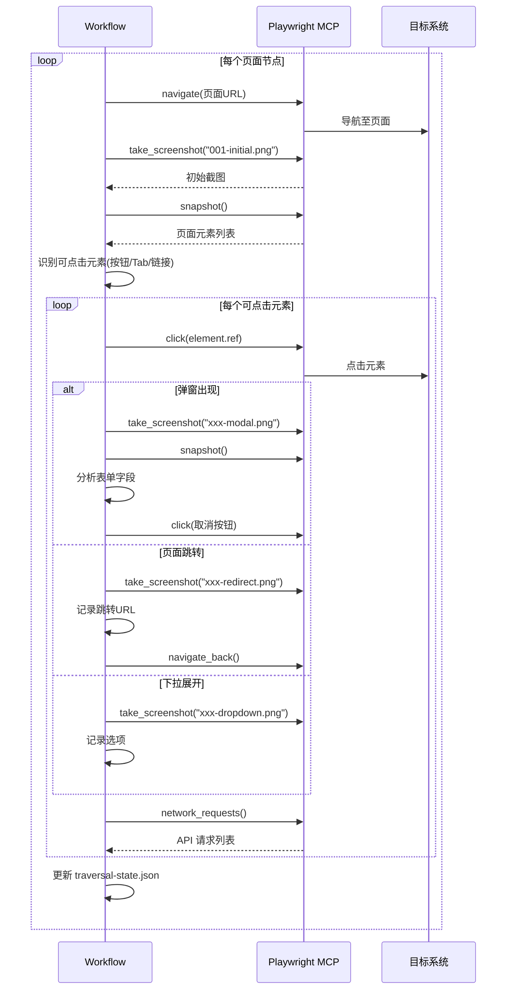
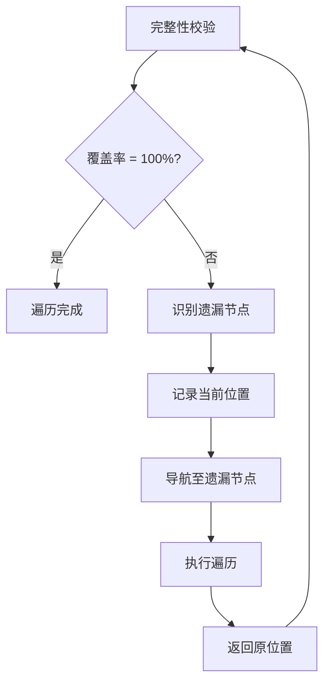

## User Input

```text
$ARGUMENTS
```

You **MUST** consider the user input before proceeding (if not empty).

**支持的参数**：
- `--resume` - 从上次中断处继续
- `--checkpoint <file>` - 从指定检查点恢复
- `--batch "<模块名>"` - 只遍历指定模块

## 流程概述

本工作流用于逆向工程的**第二阶段：全量遍历**，基于层级图谱逐节点执行可见操作，采集截图和接口信息。

> **核心原则**：所见即所得，无可视化证据不记录
> 
> ⚠️ **防遗漏原则**：每步必须读写状态文件，AI 不得依赖记忆

### 前置条件

- 已完成 `/speckit.reverse-scan`，存在 `hierarchy-graph.md` 和 `traversal-state.json`
- Playwright MCP 浏览器代理已登录目标系统

### 步骤

1. **加载上下文并恢复状态**：
   ```
   a. 读取 `.specify/memory/reverse-engineering-constitution.md`
   b. 读取 `docs/reverse/{系统}/hierarchy-graph.md`
   c. 读取 `docs/reverse/{系统}/traversal-state.json`  ← 关键！
   d. 如果是 --resume，从 current_node 继续
   e. 如果是 --checkpoint，加载指定检查点
   f. 如果是 --batch，过滤只保留指定模块的节点
   ```

2. **遍历前校验**：
   ```
   a. 从 traversal-state.json 读取 pending_nodes 列表
   b. 统计待遍历节点数
   c. 输出遍历计划：
      "本次将遍历 X 个节点，预计需要 Y 分钟"
      "待遍历节点列表：[前10个]..."
   d. 等待用户确认后继续
   ```

3. **执行全量遍历**（核心循环）：
   
   ```python
   checkpoint_counter = 0
   
   while pending_nodes 不为空:
       
       # ===== 步骤 A: 读取状态 =====
       state = read_file("traversal-state.json")
       current_node = state.pending_nodes[0]
       
       # ===== 步骤 B: 导航并截图初始状态 =====
       navigate_to(current_node)
       screenshot("001-initial.png")
       
       # ===== 步骤 C: Tab 完整遍历 [关键！] =====
       tabs = identify_tabs(snapshot)
       if len(tabs) > 1:
           for tab_index, tab in enumerate(tabs):
               click_tab(tab)
               wait_for_load()
               screenshot(f"tab-{tab_index}-{tab.name}.png")
               
               # 在每个Tab下执行完整功能点遍历
               tab_snapshot = get_page_snapshot()
               tab_elements = identify_clickable_elements(tab_snapshot)
               traverse_elements(tab_elements, tab_context=tab.name)
               
               # 记录Tab差异
               if tab_index > 0:
                   diff = compare_with_first_tab(tab_elements)
                   record_tab_diff(tab.name, diff)
       
       # ===== 步骤 D: 功能点深度遍历 [关键！] =====
       snapshot = get_page_snapshot()
       clickable_elements = identify_clickable_elements(snapshot)
       # 按优先级排序: P0(主按钮/Tab) > P1(筛选/行操作) > P2(链接)
       clickable_elements.sort(by="priority")
       
       for element in clickable_elements:
           # 记录点击前 URL
           original_url = get_current_url()
           
           # 点击元素
           click(element)
           wait_for_response(2s)
           
           # 判断响应类型并处理
           if modal_appeared():
               screenshot("xxx-modal.png")
               form_fields = analyze_modal_form()
               record_form_fields(form_fields)
               
               # ===== 业务流程遍历（测试环境） =====
               if is_create_form() and env == "test":
                   # 模拟完整新增流程
                   fill_test_data(form_fields)
                   click_submit()
                   if success:
                       screenshot("xxx-success.png")
                       verify_list_updated()
                       click_new_record_detail()
                       screenshot("xxx-detail.png")
                       cleanup_test_data()  # 删除测试数据
                   else:
                       record_validation_errors()
               else:
                   close_modal()  # 生产环境只点击取消或 X
           elif url_changed():
               screenshot("xxx-redirect.png")
               record_redirect(new_url)
               navigate_back(original_url)
           elif dropdown_expanded():
               screenshot("xxx-dropdown.png")
               options = get_dropdown_options()
               record_options(options)
               close_dropdown()
           else:
               record_no_response(element)
           
           # 捕获触发的 API
           apis = capture_api_requests()
           record_apis(apis)
       
       # ===== 步骤 D: 表格行操作遍历 =====
       if has_table():
           first_row_actions = get_row_actions(row=0)
           for action in first_row_actions:
               click(action)
               handle_response()  # 同上处理
               navigate_back_if_needed()
       
       # ===== 步骤 E: 更新状态（必须！）=====
       state.completed_nodes.append({
           "id": current_node,
           "clickable_elements": len(clickable_elements),
           "forms_found": forms_count,
           "apis_captured": apis_count
       })
       state.pending_nodes.remove(current_node)
       state.traversed_count += 1
       state.current_node = pending_nodes[0] if pending_nodes else None
       state.last_update = now()
       write_file("traversal-state.json", state)  # ← 每步必须写入！
       
       # ===== 步骤 F: 检查点 =====
       checkpoint_counter += 1
       if checkpoint_counter >= 5:
           save_checkpoint()
           checkpoint_counter = 0
           output_progress()
   ```

4. **每 5 个节点输出进度**：
   ```markdown
   ## 遍历进度报告
   
   | 项目 | 数值 |
   |------|------|
   | 已遍历 | 45 |
   | 待遍历 | 111 |
   | 总计 | 156 |
   | **进度** | **28.8%** |
   
   ### 刚完成的 5 个节点
   1. ✅ 客户管理-客户维护-客户列表
   2. ✅ 客户管理-客户维护-新增客户
   3. ✅ 客户管理-客户维护-编辑客户
   4. ⚠️ 客户管理-客户维护-删除客户 (权限不足)
   5. ✅ 客户管理-客户分组-分组列表
   
   ### 接下来 5 个节点
   1. ⬜ 客户管理-客户分组-新增分组
   2. ⬜ 客户管理-客户分组-编辑分组
   3. ⬜ 订单中心-订单查询-待处理订单
   4. ⬜ 订单中心-订单查询-已完成订单
   5. ⬜ 订单中心-订单详情-基本信息
   
   是否继续？(y/n)
   ```

5. **处理特殊场景**：
   
   | 场景 | 处理 |
   |------|------|
   | 权限不足 | 截图记录状态，标记 ⚠️ |
   | 弹窗阻挡 | 处理弹窗后继续 |
   | 加载失败 | 重试 3 次，仍失败则记录 |

6. **遍历后强制校验**：
   
   ```
   a. 读取 traversal-state.json
   b. 读取 hierarchy-graph.md 统计总节点数 N
   c. 对比：
      - 已遍历数 = completed_nodes 长度
      - 待遍历数 = pending_nodes 长度
      - 校验：已遍历数 + 待遍历数 = N
   d. 如果 待遍历数 > 0：
      - 列出所有遗漏节点
      - 询问是否继续遍历
   e. 生成 missing-nodes-check.md
   ```

7. **生成遍历报告**：
   - 更新 `traversal-paths.md` 遍历状态
   - 更新 `traversal-state.json` 最终状态
   - 生成 `missing-nodes-check.md` 校验报告

8. **报告**：输出遍历完成统计

## 输出物

| 文件 | 说明 |
|------|------|
| `traversal-state.json` | 遍历状态文件（实时更新） |
| `traversal-paths.md` | 遍历路径清单（含状态） |
| `missing-nodes-check.md` | 遗漏节点校验报告 |
| `checkpoints/*.json` | 检查点文件 |
| `screenshots/*.png` | 所有节点的操作截图 |
| `api-requests.json` | 捕获的原始接口数据 |

## Playwright 深度遍历操作序列



## 深度遍历 Playwright 示例

### 1. 识别可点击元素

```javascript
// 获取页面快照
const snapshot = await mcp1_browser_snapshot();

// 从快照中识别可点击元素
// 优先级规则：
// P0: button[新增/添加/创建], role=tab
// P1: button[筛选/搜索], 表格行操作
// P2: link, 图标按钮
```

### 2. 点击按钮并处理弹窗

```javascript
// 点击"添加客户"按钮
await mcp1_browser_click({
  element: "添加客户按钮",
  ref: "A[xxx]"  // 从 snapshot 获取
});

// 等待响应
await mcp1_browser_wait_for({ time: 2 });

// 检查是否出现弹窗
const afterSnapshot = await mcp1_browser_snapshot();
// 如果有 dialog/modal，截图并分析

// 截图弹窗内容
await mcp1_browser_take_screenshot({
  filename: "002-add-customer-modal.png"
});

// 分析表单字段（从 snapshot 中提取）
// 记录：字段名、类型、是否必填

// 关闭弹窗（点击取消）
await mcp1_browser_click({
  element: "取消按钮",
  ref: "B[xxx]"
});
```

### 3. 处理 Tab 切换

```javascript
// 点击 Tab
await mcp1_browser_click({
  element: "合作伙伴推广客户 Tab",
  ref: "T[xxx]"
});

await mcp1_browser_wait_for({ time: 1 });

// 截图 Tab 切换后的内容
await mcp1_browser_take_screenshot({
  filename: "003-tab-partner.png"
});

// 获取新 Tab 下的数据
const tabSnapshot = await mcp1_browser_snapshot();
// 记录 Tab 内容差异
```

### 4. 表格行操作遍历

```javascript
// 获取第一行的操作按钮
// 通常在 snapshot 中找 role=row 下的 button/link

// 点击"编辑"
await mcp1_browser_click({
  element: "第一行编辑按钮",
  ref: "R[xxx]"
});

await mcp1_browser_wait_for({ time: 2 });

// 截图编辑页面/弹窗
await mcp1_browser_take_screenshot({
  filename: "004-edit-row.png"
});

// 返回列表（关闭弹窗或浏览器后退）
await mcp1_browser_click({
  element: "取消/关闭按钮",
  ref: "C[xxx]"
});
```

### 5. 捕获 API 请求

```javascript
// 每次点击操作后，获取网络请求
const requests = await mcp1_browser_network_requests();

// 过滤出 API 请求（排除静态资源）
const apiRequests = requests.filter(r => 
  r.url.includes('/api/') || 
  r.method !== 'GET'
);

// 记录到文档
```

## 遍历状态表格式

```markdown
| 序号 | 节点标识 | 层级 | 状态 | 素材编号 | 接口数 | 备注 |
|------|----------|------|------|----------|--------|------|
| 1 | 客户管理-客户维护-客户列表 | L3 | ✅ | 0001-0005 | 3 | - |
| 2 | 客户管理-客户维护-新增客户 | L4 | ✅ | 0006-0010 | 2 | - |
| 3 | 客户管理-客户维护-删除客户 | L4 | ⚠️ | 0011 | 0 | 权限不足 |
```

## 回溯机制



## Key Rules

- **100% 覆盖**：所有可见节点必须遍历
- **双截图**：每个操作前后各截图一次
- **接口捕获**：记录所有触发的 API 请求
- **状态实时更新**：每完成一个节点立即更新状态
- **回溯补全**：发现遗漏自动回溯
- 遵循 `reverse-engineering-constitution.md` 规约
