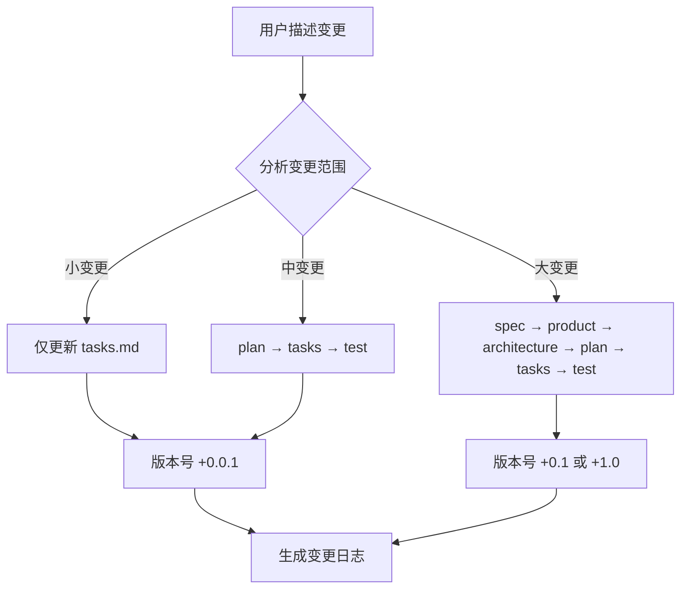

## User Input

```text
$ARGUMENTS
```

You **MUST** consider the user input before proceeding (if not empty).

## 流程概述

当需求发生变更时，无需逐步执行 10 个工作流。本工作流会：
1. **智能分析变更范围**（小/中/大）
2. **识别受影响文档**
3. **批量更新**所有相关文档
4. **版本追溯**



---

## 步骤

### 1. 收集变更信息

**询问用户**（如未在 $ARGUMENTS 中提供）：

```
请描述本次需求变更：
1. 变更内容是什么？
2. 变更原因是什么？
3. 是否影响用户流程？（是/否）
4. 是否影响数据结构？（是/否）
5. 是否影响系统架构？（是/否）
```

### 2. 加载当前规约

读取以下文件获取现有上下文：

```
.specify/memory/
├── constitution.md      # 项目规约
├── spec.md              # 需求规格
├── product.md           # 产品设计（如存在）
├── architecture.md      # 架构设计（如存在）
├── plan.md              # 开发计划
├── tasks.md             # 任务清单
└── test.md              # 测试方案（如存在）
```

### 3. 智能分析变更范围

根据用户描述，判断变更级别：

| 变更级别 | 判断条件 | 示例 |
|----------|----------|------|
| **小变更** | 仅影响具体任务实现，不改变功能逻辑 | 字段重命名、文案调整、Bug 修复 |
| **中变更** | 功能逻辑调整，但不改变整体需求和架构 | 新增字段、调整业务规则、优化流程 |
| **大变更** | 需求本身变化，或影响系统架构 | 新增模块、删除功能、技术栈变更 |

**输出判断结果**：
```
📊 变更分析结果：
- 变更级别: {小/中/大}变更
- 判断依据: {原因}
- 受影响文档: {文档列表}
```

### 4. 确定更新范围

| 变更级别 | 需更新的文档 | 版本号变化 |
|----------|--------------|------------|
| **小变更** | `tasks.md` | +0.0.1 |
| **中变更** | `plan.md` → `tasks.md` → `test.md` | +0.1 |
| **大变更** | `spec.md` → `product.md` → `architecture.md` → `plan.md` → `tasks.md` → `test.md` | +1.0 |

### 5. 执行批量更新

#### 5.1 小变更（仅更新 tasks.md）

1. 读取 `.specify/memory/tasks.md`
2. 根据变更内容，新增/修改/删除相关任务
3. 更新版本号
4. 写回文件

#### 5.2 中变更（更新 plan → tasks → test）

按顺序更新：

1. **plan.md**：调整受影响的里程碑、工时估算
2. **tasks.md**：更新任务列表
3. **test.md**：更新受影响的测试用例

#### 5.3 大变更（全链路更新）

按依赖顺序更新：

1. **spec.md**：更新需求规格、用户故事
2. **product.md**：更新产品设计、用户流程
3. **architecture.md**：更新架构设计、API 定义、数据模型
4. **plan.md**：更新开发计划、里程碑
5. **tasks.md**：重新生成任务清单
6. **test.md**：更新测试方案

### 6. 记录变更日志

在每个更新的文档中添加变更记录：

```markdown
---
## 变更历史

| 版本 | 日期 | 变更类型 | 变更内容 | 原因 |
|------|------|----------|----------|------|
| V{新版本} | {今日日期} | {小/中/大}变更 | {变更摘要} | {变更原因} |
```

### 7. 同步归档文档（如需要）

如果 `docs/` 目录下有对应的归档文档，也需要同步更新：

| 规约文档 | 归档位置 |
|----------|----------|
| `spec.md` | `docs/demand/{功能}-需求规格.md` |
| `product.md` | `docs/product/{功能}-产品设计-V{版本}.md` |
| `architecture.md` | `docs/architecture/{功能}-架构设计-V{版本}.md` |
| `plan.md` | `docs/plan/{功能}-开发计划.md` |
| `tasks.md` | `docs/plan/{功能}-任务清单.md` |
| `test.md` | `docs/test/{功能}-测试用例.md` |

### 8. 输出更新报告

```markdown
# 📋 增量更新报告

## 变更概要
- **变更级别**: {小/中/大}变更
- **变更原因**: {原因}
- **更新时间**: {时间}

## 已更新文档

| 文档 | 旧版本 | 新版本 | 主要变更 |
|------|--------|--------|----------|
| {文档名} | V{旧} | V{新} | {变更摘要} |

## 变更详情

### {文档1}
- {具体变更点1}
- {具体变更点2}

### {文档2}
- {具体变更点1}

## 后续建议
- [ ] {建议1}
- [ ] {建议2}
```

---

## Key Rules

- **先分析后更新**：必须先判断变更范围，避免过度更新
- **保持一致性**：更新时确保文档间的引用和依赖关系正确
- **版本追溯**：每次更新必须记录变更历史
- **最小化原则**：仅更新受影响的内容，不做无关修改
- **同步归档**：规约文档和归档文档必须保持同步

## 使用示例

### 示例 1：小变更
```
/speckit.update 用户表新增 phone 字段，用于短信通知
```

### 示例 2：中变更
```
/speckit.update 审批流程从单级改为两级审批，先部门经理后财务主管
```

### 示例 3：大变更
```
/speckit.update 取消 Excel 上传功能，改为在线表格直接编辑
```
