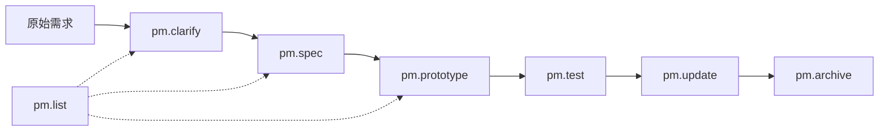

# 产品经理 AI 原型工具使用指南

> 本指南帮助产品经理快速上手使用 AI 辅助生成可交互 HTML 原型。

---

## 目录

1. [快速开始](#快速开始)
2. [命令总览](#命令总览)
3. [完整工作流程](#完整工作流程)
4. [各命令详解](#各命令详解)
5. [文件组织结构](#文件组织结构)
6. [版本管理](#版本管理)
7. [常见问题](#常见问题)
8. [最佳实践](#最佳实践)

---

## 快速开始

### 30 秒上手

```bash
# 1. 打开 Windsurf/Cursor IDE
# 2. 在聊天窗口输入命令
/pm.prototype 功能:用户登录 描述:实现账号密码登录页面
```

AI 会自动：
1. 检测 Git 环境
2. 询问迭代信息
3. 生成 HTML 原型
4. 更新索引页
5. 提示是否提交 Git

### 首次使用检查清单

- [ ] 确保已安装 Git（Mac 用户执行 `xcode-select --install`）
- [ ] 配置 Git 用户信息：
  ```bash
  git config --global user.name "你的姓名"
  git config --global user.email "你的邮箱"
  ```
- [ ] 确认在正确的项目目录下

---

## 命令总览



| 命令 | 作用 | 何时使用 |
|------|------|----------|
| `/pm.clarify` | 需求澄清 | 需求模糊、不完整时 |
| `/pm.spec` | 需求整理 | 整理结构化需求文档 |
| `/pm.prototype` | 生成原型 | 生成可交互 HTML |
| `/pm.update` | 更新原型 | 修改已有文档/原型 |
| `/pm.list` | 查看列表 | 查看所有迭代和状态 |
| `/pm.archive` | 迭代归档 | 迭代结束时归档 |
| `/pm.test` | 自动化测试 | 对原型进行浏览器自动化测试 |

### 快捷流程选择

| 你的情况 | 推荐流程 |
|----------|----------|
| 需求很明确，想直接出原型 | `/pm.prototype` |
| 需求明确，需要文档记录 | `/pm.spec` → `/pm.prototype` |
| 需求模糊，需要先理清 | `/pm.clarify` → `/pm.spec` → `/pm.prototype` |
| 修改已有原型 | `/pm.update` |

---

## 完整工作流程

### 场景一：从零开始的完整流程

**第 1 步：需求澄清**

```bash
/pm.clarify
```

AI 会询问：
- 迭代名称（如：2026-01-用户管理）
- 功能名称（如：用户登录）
- 你的名字
- 原始需求描述

然后 AI 会生成澄清问题，你逐一回答后，生成澄清文档。

**第 2 步：需求整理**

```bash
/pm.spec
```

AI 会基于澄清文档，生成结构化需求文档，包含：
- 需求背景
- 目标用户
- 功能描述
- 用户故事
- 验收标准

**第 3 步：生成原型**

```bash
/pm.prototype
```

AI 会基于需求文档，生成可交互的 HTML 原型。

**第 4 步：查看原型**

```bash
# 方式一：直接打开文件
open docs/prototypes/2026-01-用户管理/html/用户登录-prototype.html

# 方式二：打开索引页查看所有原型
open docs/prototypes/index.html
```

---

### 场景二：快速出原型（跳过文档）

```bash
/pm.prototype 迭代:2026-01-用户管理 功能:用户登录 描述:账号密码登录页面，支持记住密码和忘记密码链接
```

AI 会直接生成原型，省去需求文档步骤。

---

### 场景三：修改已有原型

```bash
/pm.update 用户登录 增加微信登录按钮
```

或交互式：

```bash
/pm.update
# AI 会询问要修改哪个功能，以及修改内容
```

---

## 各命令详解

### `/pm.clarify` - 需求澄清

**用途**：当需求模糊或不完整时，通过结构化提问理清需求。

**使用方式**：

```bash
# 交互式（推荐）
/pm.clarify

# 带参数
/pm.clarify 迭代:2026-01-用户管理 功能:用户登录 需求:客户说要做一个登录页面
```

**产出物**：`docs/prototypes/{迭代}/requirements/{功能名}-澄清.md`

**澄清文档包含**：
- 原始需求（保持原样）
- 澄清问答记录
- 澄清结论
- 待确认项

---

### `/pm.spec` - 需求整理

**用途**：将需求整理成结构化文档，便于开发理解和验收。

**使用方式**：

```bash
# 交互式（基于已有澄清文档）
/pm.spec

# 带参数
/pm.spec 迭代:2026-01-用户管理 功能:用户登录

# 直接输入需求（跳过澄清）
/pm.spec 功能:用户登录 需求:实现账号密码登录，支持记住密码
```

**产出物**：`docs/prototypes/{迭代}/requirements/{功能名}-需求.md`

**需求文档包含**：
- 基本信息
- 需求背景
- 目标用户
- 功能描述
- 用户故事
- 业务规则
- 验收标准
- 边界与异常

---

### `/pm.prototype` - 生成原型

**用途**：生成可直接在浏览器打开的交互式 HTML 原型。

**使用方式**：

```bash
# 交互式
/pm.prototype

# 带参数
/pm.prototype 迭代:2026-01-用户管理 功能:用户登录

# 直接描述（跳过需求文档）
/pm.prototype 功能:用户登录 描述:账号密码登录页面
```

**产出物**：
- `docs/prototypes/{迭代}/html/{功能名}-prototype.html`
- 更新 `docs/prototypes/index.html`

**原型特点**：
- ✅ 单个 HTML 文件，双击即可打开
- ✅ 纯离线，无需网络
- ✅ 响应式，支持手机预览
- ✅ 可交互，按钮可点击、表单可填写

**支持的原型类型**：

| 类型 | 适用场景 | 示例 |
|------|----------|------|
| 表单页 | 登录、注册、设置 | 用户登录页 |
| 列表页 | 数据管理 | 订单列表页 |
| 详情页 | 信息展示 | 用户详情页 |
| 流程页 | 步骤引导 | 下单流程页 |
| 仪表盘 | 数据概览 | 后台首页 |
| 多Tab页 | 复杂功能 | 设置中心 |

---

### `/pm.update` - 更新原型

**用途**：修改已有的需求文档或 HTML 原型。

**使用方式**：

```bash
# 交互式
/pm.update

# 指定功能
/pm.update 用户登录

# 带修改描述
/pm.update 用户登录 增加验证码登录方式

# 完整参数
/pm.update 迭代:2026-01-用户管理 功能:用户登录 修改:增加第三方登录
```

**可更新内容**：
1. 需求澄清文档
2. 需求规格文档
3. HTML 原型
4. 全部更新

---

### `/pm.list` - 查看列表

**用途**：查看所有迭代、需求和原型的状态。

**使用方式**：

```bash
# 查看所有
/pm.list

# 筛选迭代
/pm.list 2026-01-用户管理

# 筛选状态
/pm.list 进行中
```

**输出示例**：

```
📋 产品文档列表

📁 2026-01-用户管理
   ├── 用户登录
   │   ├── ✅ 澄清完成    [2026-01-24]
   │   ├── ✅ 需求整理    [2026-01-25]
   │   └── ✅ 原型完成    [2026-01-26]
   │
   └── 用户注册
       ├── ✅ 澄清完成    [2026-01-26]
       ├── ⏳ 需求整理中
       └── ⏳ 待生成原型

📊 统计
| 迭代数 | 功能数 | 已完成原型 |
|--------|--------|------------|
| 1      | 2      | 1          |
```

---

### `/pm.archive` - 迭代归档

**用途**：迭代结束后，生成迭代总结并标记归档状态。

**使用方式**：

```bash
# 交互式
/pm.archive

# 指定迭代
/pm.archive 2026-01-用户管理

# 带摘要
/pm.archive 迭代:2026-01-用户管理 摘要:完成用户登录注册功能
```

**产出物**：
- 更新 `docs/prototypes/{迭代}/README.md`
- 更新索引页归档状态

---

## 文件组织结构

```
docs/prototypes/
├── index.html                              # 📋 原型索引页（卡片风格）
│
└── 2026-01-用户管理/                        # 📁 迭代目录
    ├── README.md                           # 迭代概览
    │
    ├── requirements/                       # 📄 需求文档
    │   ├── 用户登录-澄清.md                 # 需求澄清记录
    │   ├── 用户登录-需求.md                 # 结构化需求文档
    │   ├── 用户登录-附件/                   # 附件目录（截图等）
    │   │   └── 参考截图.png
    │   ├── 用户注册-澄清.md
    │   └── 用户注册-需求.md
    │
    └── html/                               # 🎨 HTML原型
        ├── 用户登录-prototype.html
        └── 用户注册-prototype.html
```

### 迭代命名规范

格式：`{YYYY-MM}-{迭代主题}`

示例：
- `2026-01-用户管理`
- `2026-02-订单系统`
- `2026-03-支付功能`

---

## 版本管理

所有文档和原型通过 **Git** 进行版本管理。

### 查看历史版本

```bash
# 查看某个原型的历史
git log --oneline docs/prototypes/2026-01-用户管理/html/用户登录-prototype.html

# 输出示例：
# abc1234 pm(原型): 用户登录 - 增加验证码登录
# def5678 pm(原型): 用户登录 - 新增原型
```

### 恢复历史版本

```bash
# 恢复到某个版本
git checkout abc1234 -- docs/prototypes/2026-01-用户管理/html/用户登录-prototype.html
```

### 查看版本差异

```bash
# 查看最近一次修改
git diff HEAD~1 docs/prototypes/2026-01-用户管理/
```

### 提交规范

AI 会自动使用以下格式提交：

| 操作 | Commit 格式 |
|------|-------------|
| 新增澄清 | `pm(澄清): {功能名} - 需求澄清完成` |
| 新增需求 | `pm(需求): {功能名} - 需求整理完成` |
| 新增原型 | `pm(原型): {功能名} - 新增原型` |
| 更新原型 | `pm(更新): {功能名} - {修改简述}` |
| 迭代归档 | `pm(归档): {迭代名称} - 迭代归档完成` |

---

## 常见问题

### Q1: 如何预览原型？

**方式一**：直接双击 HTML 文件

```bash
open docs/prototypes/2026-01-用户管理/html/用户登录-prototype.html
```

**方式二**：打开索引页

```bash
open docs/prototypes/index.html
```

索引页会以卡片形式展示所有原型，点击即可预览。

**方式三**：手机预览

1. 在电脑上启动本地服务器：
   ```bash
   cd docs/prototypes
   python3 -m http.server 8080
   ```
2. 手机访问 `http://电脑IP:8080`

---

### Q2: 原型可以分享给别人吗？

可以！HTML 原型是独立文件，直接发送即可。接收方无需安装任何软件，双击打开即可预览。

---

### Q3: 如何添加设计参考图？

1. 将图片放入附件目录：
   ```
   docs/prototypes/{迭代}/requirements/{功能名}-附件/
   ```

2. 在需求文档中引用：
   ```markdown
   
   ```

3. 告诉 AI 参考这张图生成原型

---

### Q4: 原型的交互能做到什么程度？

当前支持：
- ✅ 按钮点击反馈
- ✅ 表单输入校验
- ✅ 状态切换（如 Tab 切换）
- ✅ 弹窗提示
- ✅ 页面跳转模拟

暂不支持：
- ❌ 真实数据请求
- ❌ 复杂动画效果
- ❌ 多页面跳转（需生成多个文件）

---

### Q5: 生成的原型不满意怎么办？

```bash
# 方式一：直接更新
/pm.update 用户登录 把登录按钮改成蓝色，增加忘记密码链接

# 方式二：重新生成
/pm.prototype 功能:用户登录 描述:重新设计登录页，风格简洁现代
```

---

### Q6: Git 相关问题

**未安装 Git**：
```bash
# Mac
xcode-select --install
```

**未配置用户信息**：
```bash
git config --global user.name "你的姓名"
git config --global user.email "你的邮箱"
```

**不想提交 Git**：
每次 AI 询问"是否提交到 Git？"时，回答"n"即可跳过。

---

## 最佳实践

### 1. 迭代规划

- 每个迭代聚焦一个主题（如：用户管理、订单系统）
- 迭代命名统一格式：`{YYYY-MM}-{主题}`
- 迭代结束后执行 `/pm.archive` 归档

### 2. 需求描述

**好的描述**：
```
用户登录页面，包含：
1. 账号密码登录（账号支持手机号/邮箱）
2. 验证码登录
3. 记住密码选项
4. 忘记密码链接
5. 第三方登录（微信、支付宝）
```

**不好的描述**：
```
做一个登录页
```

### 3. 原型迭代

- 先生成基础版本，再逐步完善
- 每次更新聚焦一个改动点
- 保持提交记录清晰

### 4. 团队协作

- 统一迭代命名规范
- 需求文档及时更新
- 定期执行 `/pm.list` 查看进度

---

## 附录：命令速查表

| 我想要... | 执行命令 |
|-----------|----------|
| 理清模糊需求 | `/pm.clarify` |
| 整理需求文档 | `/pm.spec` |
| 生成 HTML 原型 | `/pm.prototype` |
| 快速出原型（跳过文档） | `/pm.prototype 功能:xxx 描述:xxx` |
| 修改已有原型 | `/pm.update {功能名} {修改内容}` |
| 查看所有原型 | `/pm.list` |
| 迭代结束归档 | `/pm.archive {迭代名}` |
| 打开原型预览 | `open docs/prototypes/index.html` |
| 查看原型历史 | `git log --oneline docs/prototypes/{迭代}/html/{功能}-prototype.html` |

---

*文档版本：V1.0 | 更新日期：2026-01-26*
