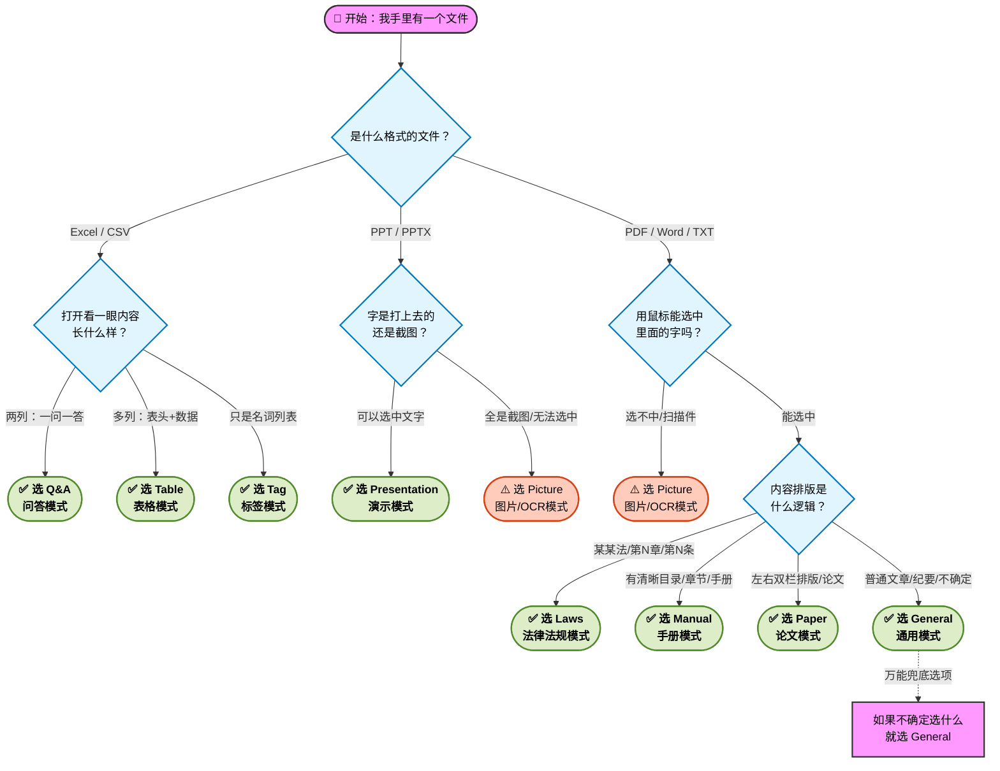

# RAGflow文档类别和解析方式

#### 1. 如果你手里的文件是 Excel (.xlsx, .xls) 或 CSV

Excel 是 RAG 系统中最容易产出高质量回答的格式，但前提是你要告诉 AI 这一行行数据代表什么。

*   **场景 A：这是“问题+答案”的对照表（最推荐 ⭐⭐⭐⭐⭐）**
    
*   **比如：**  
    
    
    *   **文件长相：** 只有两列。第一列是用户常问的问题，第二列是标准回答。或者虽然有很多列，但主要逻辑是“问”与“答”。
        
    *   **选择解析方式：** **Q&A（问答）**
        
    *   **原理（通俗版）：** AI 会把每一行看作一对独立的“问答卡片”。用户问第一列的问题，AI 直接把第二列甩给他。这是最精准的。
        
    
    **注意：** 千万不要合并单元格 。
    
*   **场景 B：这是纯数据表（价格表、参数表、花名册）**
    
*   **比如：**
    
                                         
    
    *   **文件长相：** 第一行是表头（如：型号、价格、颜色、库存），下面全是对应的数据。
        
    *   **选择解析方式：** **Table（表格）**
        
    
    **原理（通俗版）：** AI 会把每一行数据看作一条记录。它会记住“A型号的价格是100元”。如果你选错了模式，AI 可能会把价格和型号搞混 。
    
*   **场景 C：这是用来打标签的词库**
    
*   **比如：**
    
*   
    
    *   **文件长相：** 里面是一堆专有名词，比如“所有支持的车型列表”或“所有分公司名单”。
        
    *   **选择解析方式：** **Tag（标签）**
        

**原理（通俗版）：** 这不是用来回答问题的，而是给其他文件做分类过滤用的 。

---

#### 2. 如果你手里的文件是 Word (.docx)

Word 文档最灵活，所以要看它主要写了什么。

*   **场景 A：普通的文章、通知、纪要、知识点总结（最常用）**
    
    **比如：**
    
    
    
    *   **文件长相：** 有标题，有段落，就像我们平时写的作文。
        
    *   **选择解析方式：** **General（通用）**
        
    
    **原理（通俗版）：** 系统会像切香肠一样，按字数把文章切成一段段喂给 AI。这是最保险的“万金油”模式 。
    
*   **场景 B：公司的规章制度、法律法规**
    
    *   **文件长相：** 有非常严格的条款编号，比如“第一章”、“1.1 条”、“(a) 项”。
        
    *   **选择解析方式：** **Laws（法律）**
        
    
    **原理（通俗版）：** AI 会特别留意这些编号，保证回答时引用准确，不会把第1条和第2条搞混 。
    
*   **场景 C：只有一段话的超短简介**
    
    *   **文件长相：** 比如只有200字的公司介绍，不想被拆开。
        
    *   **选择解析方式：** **One（整体）**
        
    

**原理（通俗版）：** 强行告诉 AI：“这一整页纸是一个整体，别切开” 。

---

#### 3. 如果你手里的文件是 PDF (.pdf)

PDF 是最难处理的，因为电脑看 PDF 其实是在看“画”。

*   **场景 A：产品手册、操作说明书、员工手册**
    
    *   **文件长相：** 文档很长，**关键是有清晰的层级标题（目录）**。比如左侧有导航栏，或者正文中大标题、小标题很明显。
        
    *   **选择解析方式：** **Manual（手册）**
        
    
    **原理（通俗版）：** 系统会先去读目录，搞清楚哪一段属于哪一章。如果用户问“如何开机”，AI 会知道去“操作指南”章节找，而不是去“保修政策”里找 。
    
*   **场景 B：学术论文**
    
    *   **文件长相：** 双栏排版（一页纸分左右两列），有摘要（Abstract）、参考文献。
        
    *   **选择解析方式：** **Paper（论文）**
        
    
    **原理（通俗版）：** 系统知道怎么读这种分栏的文字，不会把左边那列的字和右边那列拼在一起读串行了 。
    
*   **场景 C：实在不知道选啥的普通文档**
    
    *   **文件长相：** 就是转成 PDF 的普通文档，没啥复杂排版。
        
    *   **选择解析方式：** **General（通用）**
        
*   **⚠️ 红色警报：扫描件/图片版 PDF**
    
    *   **判断方法：** 用鼠标在文件里选文字，选不中？那就是图片版。
        

**处理建议：** **尽量别传！** 如果非要传，需要找技术人员开启 OCR（文字识别）功能，或者在解析设置里选 **Picture** 模式，但效果通常不如文字版好 。

---

#### 4. 如果你手里的文件是 PPT (.pptx)

比如：

*   **场景：培训课件、产品介绍 PPT**
    
    *   **文件长相：** 一页一页的幻灯片。
        
    *   **选择解析方式：** **Presentation（演示文稿）**
        
    *   **原理（通俗版）：** AI 会把每一页 PPT 当作一个独立的知识点。
        
    

**避坑：** 如果 PPT 里全是截图（字都在图里），AI 是读不到的。请把图里的字打在备注栏里 。

---

### 💡 总结：一图胜千言

